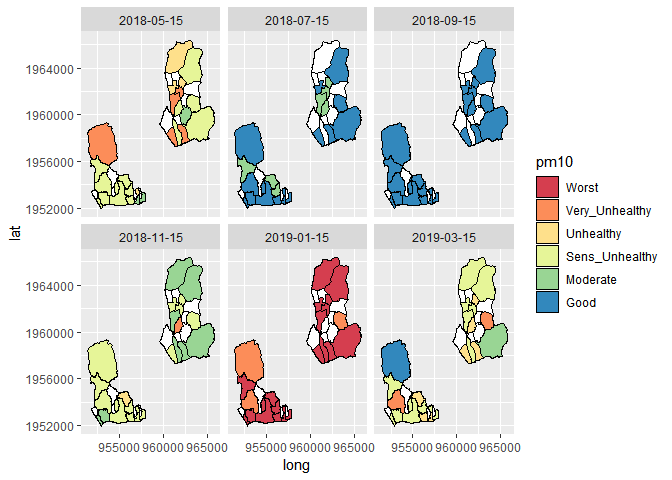

``` r
library(tidyverse)
library(ggplot2)
library(rgdal)
library(ggmap)
library(maptools)
library(readxl)
library(rebus)
library(gridExtra)
source("https://raw.githubusercontent.com/S0Hye0NKim/bigcon/master/bigcon_function.R")
load("Data_Cleansing.RData")
```

``` r
loc_Wth_Jongno <- read_xlsx("04_Innovation 분야_환경기상데이터(케이웨더)_데이터정의서(행정동추가).xlsx", 
                     range = "B1:E32", sheet = 2) 
loc_Wth_Nowon <- read_xlsx("04_Innovation 분야_환경기상데이터(케이웨더)_데이터정의서(행정동추가).xlsx", 
                     range = "H1:K23", sheet = 2) 
loc_Wth <- rbind(loc_Wth_Jongno, loc_Wth_Nowon) %>%
  select(serial = "스테이션", location = "위치", HDONG_NM = "행정동")

setwd("C:/Users/kshye/bigcon/유동인구데이터/행정동경계파일")
path <- "종로_노원_행정동.shp"
HDONG_map_shp <- readOGR(path, stringsAsFactors = FALSE, encoding = "UTF-8")
```

    ## OGR data source with driver: ESRI Shapefile 
    ## Source: "C:\Users\kshye\bigcon\유동인구데이터\행정동경계파일\종로_노원_행정동.shp", layer: "종로_노원_행정동"
    ## with 36 features
    ## It has 11 fields

``` r
HDONG_map <- fortify(HDONG_map_shp)
data_slot <- HDONG_map_shp@data
HDONG_NM <- cbind(id = row.names(data_slot), HDONG_NM = as.character(data_slot$HDONG_NM))


DONG_map_CD <- as_tibble(HDONG_NM) %>% left_join(HDong_CD, by = "HDONG_NM") %>%
  mutate(HDONG_NM = HDONG_NM %>% str_replace_all(DOT,","), 
         HDONG_NM = HDONG_NM %>% str_replace_all("종로" %R% SPC %R% "1", "종로" %R% "1"))
HDONG_NM_map <- HDONG_map %>% left_join(DONG_map_CD, by = "id") %>% tbl_df
```

1. Weather
==========

공기 질이 제일 좋지 않은 1/12, 2/10, 3/1 지도를 그려보자.

``` r
set.seed(2)
Target_Day <- seq(from = as.Date("2018-05-15"), to = as.Date("2019-03-15"), by= "month") %>% 
  sort() %>% as.character() 
Target_Day <- Target_Day[seq(1, 12, by = 2)]
Dust_lev_desc <- c("Worst", "Very_Unhealthy", "Unhealthy", "Sens_Unhealthy", "Moderate", "Good")

Jongno_obs <- Wth_Jongno[-1] %>% lapply(FUN = function(x) x %>% filter(Day %in% Target_Day) %>%
                                        select(-flag, -co2, -vocs) %>% mutate_all(as.character)) %>%
  bind_rows %>% na.omit()


Nowon_obs <- Wth_Nowon %>% lapply(FUN = function(x) x %>%  filter(Day %in% Target_Day) %>% 
                                      select(-flag, -co2, -vocs) %>% mutate_all(as.character))  %>%
  bind_rows()

Wth_Category <- bind_rows(Jongno_obs, Nowon_obs) %>%
  filter(!is.na(pm10), !is.na(pm25)) %>%
  mutate(pm10 = as.numeric(pm10), 
         pm25 = as.numeric(pm25), 
         pm10 = case_when((pm10 <= 30) ~ "Good", 
                          (pm10>30 & pm10<=50) ~ "Moderate", 
                          (pm10>50 & pm10<=75) ~ "Sens_Unhealthy", 
                          (pm10>75 & pm10<=100) ~ "Unhealthy", 
                          (pm10>100 & pm10<=150) ~ "Very_Unhealthy", 
                          (pm10>150) ~ "Worst"), 
         pm25 = case_when((pm25 <= 15) ~ "Good", 
                          (pm25>15 & pm25<=25) ~ "Moderate", 
                          (pm25>25 & pm25<=37) ~ "Sens_Unhealthy", 
                          (pm25>37 & pm25<=50) ~ "Unhealthy", 
                          (pm25>50 & pm25<=75) ~ "Very_Unhealthy", 
                          (pm25>75) ~ "Worst")) %>%
  left_join(loc_Wth, by = "serial") %>%
  group_by(Day, HDONG_NM) %>%
  summarise(pm10 = pm10 %>% Mode, 
            pm25 = pm25 %>% Mode) %>%
  mutate(pm10 = factor(pm10, levels = Dust_lev_desc), 
         pm25 = factor(pm25, levels = Dust_lev_desc)) %>%
  mutate(HDONG_NM = HDONG_NM %>% str_replace_all(",", DOT), 
         HDONG_NM = HDONG_NM %>% str_replace_all("종로" %R% SPC %R% "1", 
                                             "종로" %R% "1")) %>%
  left_join(HDong_CD, by = "HDONG_NM")

DONG_map_CD <- as_tibble(HDONG_NM) %>% left_join(HDong_CD, by = "HDONG_NM") %>%
  mutate(HDONG_NM = HDONG_NM %>% str_replace_all(DOT,","), 
         HDONG_NM = HDONG_NM %>% str_replace_all("종로" %R% SPC %R% "1", "종로" %R% "1"))
HDONG_map <- HDONG_map %>% left_join(DONG_map_CD, by = "id") %>% tbl_df

Wth_Category_Coord <- Wth_Category %>%
  left_join(y = HDONG_NM_map, by = c("HDONG_CD", "GU_CD", "GU_NM"))


HDONG_map %>%
  ggplot() +
  geom_polygon(aes(x = long, y = lat, group = group), fill = "#FFFFFF", colour = "#000000") +
  geom_polygon(data = Wth_Category_Coord, 
               aes(x = long, y = lat, fill = pm25, group = group), color = "#000000") +
  scale_fill_brewer(palette = "Spectral") +
  facet_wrap(~Day, nrow = 2)
```


``` r
HDONG_map %>%
  ggplot() +
  geom_polygon(aes(x = long, y = lat, group = group), fill = "#FFFFFF", colour = "#000000") +
  geom_polygon(data = Wth_Category_Coord, 
               aes(x = long, y = lat, fill = pm10, group = group), color = "#000000") +
  scale_fill_brewer(palette = "Spectral") +
  facet_wrap(~Day, nrow = 2)
```


흰색 : 관측치 없음.

SK
==

``` r
Card %>% separate(HDONG_CD, into = c("GU_CD", "DONG_CD"), sep = 3) %>%
  mutate(GU_CD = recode(GU_CD, "110" = "1111", "350" = "1135")) %>%
  unite(HDONG_CD, GU_CD, "DONG_CD", sep = "")
```

    ## # A tibble: 1,998,575 x 8
    ## # Groups:   STD_DD [365]
    ##    STD_DD     HDONG_CD MCT_CAT_CD SEX_CD AGE_CD USE_CNT USE_AMT AGE   
    ##    <chr>      <chr>         <int> <chr>   <int>   <int>   <int> <fct> 
    ##  1 2018-04-01 11110515         21 F          55       4      22 Middle
    ##  2 2018-04-01 11110515         21 M          20      35     184 Youth 
    ##  3 2018-04-01 11110515         21 M          25      70     425 Rising
    ##  4 2018-04-01 11110515         21 M          30      18      82 Rising
    ##  5 2018-04-01 11110515         21 M          35       4      44 Rising
    ##  6 2018-04-01 11110515         22 F          20       4      18 Youth 
    ##  7 2018-04-01 11110515         22 F          25       4     158 Rising
    ##  8 2018-04-01 11110515         22 F          45       4      26 Middle
    ##  9 2018-04-01 11110515         22 M          25       4      35 Rising
    ## 10 2018-04-01 11110515         22 M          30      13     329 Rising
    ## # ... with 1,998,565 more rows

SH Card
=======

``` r
Card <- Card %>% 
  separate(HDONG_CD, into = c("GU_CD", "DONG_CD"), sep = 3) %>%
  mutate(GU_CD = recode(GU_CD, "110" = "1111", "350" = "1135")) %>%
  unite(HDONG_CD, GU_CD, "DONG_CD", sep = "")

Card_Smr <- Card %>%
  group_by(HDONG_CD) %>%
  summarise(SUM_CNT = sum(USE_CNT), SUM_AMT = sum(USE_AMT), MODE_CAT = Mode(MCT_CAT_CD), 
            Avg_CNT = mean(USE_CNT), AVg_AMT = mean(USE_AMT)) %>%
  mutate(HDONG_CD = as.numeric(HDONG_CD)) %>%
  left_join(MCT_CAT_CD, by = c("MODE_CAT" = "MCT_CD")) 
  
Card_Sum_Coord <- Card_Smr %>% 
  left_join(y = HDONG_map, by = "HDONG_CD")


HDONG_map %>%
  ggplot() +
  geom_polygon(data = Card_Sum_Coord , aes(x = long, y = lat, group = group, fill = SUM_CNT), 
               color = "#FFFFFF") +
  scale_fill_gradient(name = "총 결제 횟수", trans = "log", low = "#56B1F7", high = "#132B43")
```


``` r
HDONG_map %>%
  ggplot() +
  geom_polygon(data = Card_Sum_Coord , aes(x = long, y = lat, group = group, fill = SUM_AMT), 
               color = "#FFFFFF") +
  scale_fill_gradient(name = "매출액 총합", trans = "log", low = "#56B1F7", high = "#132B43")
```


``` r
HDONG_map %>%
  ggplot() +
  geom_polygon(data = Card_Sum_Coord , aes(x = long, y = lat, group = group, fill = MCT_NM),  
               colour = "#000000") 
```


