``` r
library(tidyverse)
library(ggplot2)
library(rgdal)
library(ggmap)
library(maptools)
library(readxl)
library(rebus)
library(gridExtra)
source("https://raw.githubusercontent.com/S0Hye0NKim/bigcon/master/bigcon_function.R")
load("Data_Cleansing.RData")
Dust_Warning <- readRDS("Dust_Warning.rds")
```

``` r
loc_Wth_Jongno <- read_xlsx("04_Innovation 분야_환경기상데이터(케이웨더)_데이터정의서(행정동추가).xlsx", 
                     range = "B1:E32", sheet = 2) 
loc_Wth_Nowon <- read_xlsx("04_Innovation 분야_환경기상데이터(케이웨더)_데이터정의서(행정동추가).xlsx", 
                     range = "H1:K23", sheet = 2) 
loc_Wth <- rbind(loc_Wth_Jongno, loc_Wth_Nowon) %>%
  select(serial = "스테이션", location = "위치", HDONG_NM = "행정동")

setwd("C:/Users/kshye/bigcon/유동인구데이터/행정동경계파일")
path <- "종로_노원_행정동.shp"
HDONG_map_shp <- readOGR(path, stringsAsFactors = FALSE, encoding = "UTF-8")
```

    ## OGR data source with driver: ESRI Shapefile 
    ## Source: "C:\Users\kshye\bigcon\유동인구데이터\행정동경계파일\종로_노원_행정동.shp", layer: "종로_노원_행정동"
    ## with 36 features
    ## It has 11 fields

``` r
HDONG_map <- fortify(HDONG_map_shp)
data_slot <- HDONG_map_shp@data
HDONG_NM <- cbind(id = row.names(data_slot), HDONG_NM = as.character(data_slot$HDONG_NM))

DONG_map_CD <- as_tibble(HDONG_NM) %>% left_join(HDong_CD, by = "HDONG_NM") %>%
  mutate(HDONG_NM = HDONG_NM %>% str_replace_all(DOT,","), 
         HDONG_NM = HDONG_NM %>% str_replace_all("종로" %R% SPC %R% "1", "종로" %R% "1"))
HDONG_map <- HDONG_map %>% left_join(DONG_map_CD, by = "id") %>% tbl_df
```

지도
====

``` r
Names_Jongno <- aggregate(cbind(long, lat) ~ HDONG_NM, data=HDONG_map %>% 
                            filter(GU_CD == "1111"), function(x)mean(range(x)))

HDONG_map %>%
  filter(GU_CD == "1111") %>%
  ggplot() +
  geom_polygon(aes(x = long, y = lat, group = group), fill = "white", color = "black") +
  geom_text(data = Names_Jongno, aes(x = long, y = lat, label = HDONG_NM))
```


``` r
Names_Nowon <- aggregate(cbind(long, lat) ~ HDONG_NM, data=HDONG_map %>% 
                            filter(GU_CD != "1111"), function(x)mean(range(x)))

HDONG_map %>%
  filter(GU_CD != "1111") %>%
  ggplot() +
  geom_polygon(aes(x = long, y = lat, group = group), fill = "white", color = "black") +
  geom_text(data = Names_Nowon, aes(x = long, y = lat, label = HDONG_NM))
```


주민등록인구 데이터(연령대)
===========================

``` r
Age_seq <- seq(0, 100, by = 5)
JONGNO_GU <- read_excel("Report_동별_주민등록인구.xls", range = "C8:C58", col_names = "HDONG_NM") %>% 
  pull() %>% unique
NOWON_GU <- read_excel("Report_동별_주민등록인구.xls", range = "C509:C565", col_names = "HDONG_NM") %>% 
  pull() %>% unique

People_Jongno <- read_excel("Report_동별_주민등록인구.xls", range = "D1:Z58", col_types = "text") %>%
  `names<-`(value = c("Type", "Total", paste0("Age_", Age_seq))) %>%
  filter(Type == "계")
People_Jongno <- People_Jongno[-(1:2), ] %>%
  mutate(Type = JONGNO_GU)
People_Nowon <- read_excel("Report_동별_주민등록인구.xls", range = "D509:Z565", col_names = FALSE, 
                           col_types = "text") %>%
  `names<-`(value = c("Type", "Total", paste0("Age_", Age_seq))) %>%
  filter(Type == "계") %>%
  mutate(Type = NOWON_GU)

People <- bind_rows(People_Jongno, People_Nowon) %>%
  mutate(Type = str_replace_all(Type, pattern = "·", replacement = ".")) %>%
  left_join(y = HDong_CD, by = c("Type" = "HDONG_NM"))
```

``` r
People %>%
  gather(key = "AGE", value = "value", -Type, -Total, -HDONG_CD, -GU_CD, -GU_NM) %>%
  group_by(HDONG_CD) %>%
  summarise(SUM = sum(as.numeric(value))) %>%
  left_join(y = HDONG_map, by = "HDONG_CD") %>%
  ggplot() +
  geom_polygon(aes(x = long, y = lat, group = group, fill = SUM), color = "white") +
  scale_fill_gradient(name = "인구 수", low = "#56B1F7", high = "#132B43")
```


``` r
People %>%
  gather(key = "AGE", value = "value", -Type, -Total, -GU_CD, -GU_NM, -HDONG_CD) %>%
  mutate(AGE = parse_number(AGE)) %>%
  group_by(HDONG_CD, AGE) %>%
  summarise(SUM_CNT = sum(as.numeric(value))) %>%
  filter(SUM_CNT == max(SUM_CNT)) %>%
  mutate(AGE = factor(AGE)) %>%
  left_join(y = HDONG_map, by = "HDONG_CD") %>%
  ggplot() +
  geom_polygon(aes(x = long, y = lat, group = group, fill = AGE), color = "white") +
  ggtitle("최다 거주 연령대")
```


서울시 주민등록인구 (동별) 통계 -\> 서울시 열린 데이터광장 제공

Weather
=======

공기 질이 제일 좋지 않은 1/12, 2/10, 3/1 지도를 그려보자.

``` r
Target_Day <- seq(from = as.Date("2018-05-15"), to = as.Date("2019-03-15"), by= "month") %>% 
  sort() %>% as.character() 
Target_Day <- Target_Day[seq(1, 12, by = 2)]
Dust_lev_desc <- c("Worst", "Very_Unhealthy", "Unhealthy", "Sens_Unhealthy", "Moderate", "Good")

Jongno_obs <- Wth_Jongno[-1] %>% lapply(FUN = function(x) x %>% filter(Day %in% Target_Day) %>%
                                        select(-flag, -co2, -vocs) %>% mutate_all(as.character)) %>%
  bind_rows %>% na.omit()


Nowon_obs <- Wth_Nowon %>% lapply(FUN = function(x) x %>%  filter(Day %in% Target_Day) %>% 
                                      select(-flag, -co2, -vocs) %>% mutate_all(as.character))  %>%
  bind_rows()

Wth_Category <- bind_rows(Jongno_obs, Nowon_obs) %>%
  filter(!is.na(pm10), !is.na(pm25)) %>%
  mutate(pm10 = as.numeric(pm10), 
         pm25 = as.numeric(pm25), 
         pm10 = case_when((pm10 <= 30) ~ "Good", 
                          (pm10>30 & pm10<=50) ~ "Moderate", 
                          (pm10>50 & pm10<=75) ~ "Sens_Unhealthy", 
                          (pm10>75 & pm10<=100) ~ "Unhealthy", 
                          (pm10>100 & pm10<=150) ~ "Very_Unhealthy", 
                          (pm10>150) ~ "Worst"), 
         pm25 = case_when((pm25 <= 15) ~ "Good", 
                          (pm25>15 & pm25<=25) ~ "Moderate", 
                          (pm25>25 & pm25<=37) ~ "Sens_Unhealthy", 
                          (pm25>37 & pm25<=50) ~ "Unhealthy", 
                          (pm25>50 & pm25<=75) ~ "Very_Unhealthy", 
                          (pm25>75) ~ "Worst")) %>%
  left_join(loc_Wth, by = "serial") %>%
  group_by(Day, HDONG_NM) %>%
  summarise(pm10 = pm10 %>% Mode, 
            pm25 = pm25 %>% Mode) %>%
  mutate(pm10 = factor(pm10, levels = Dust_lev_desc), 
         pm25 = factor(pm25, levels = Dust_lev_desc)) %>%
  mutate(HDONG_NM = HDONG_NM %>% str_replace_all(",", DOT), 
         HDONG_NM = HDONG_NM %>% str_replace_all("종로" %R% SPC %R% "1", 
                                             "종로" %R% "1")) %>%
  left_join(HDong_CD, by = "HDONG_NM")


Wth_Category_Coord <- Wth_Category %>%
  left_join(y = HDONG_map, by = c("HDONG_CD", "GU_CD", "GU_NM"))


HDONG_map %>%
  ggplot() +
  geom_polygon(aes(x = long, y = lat, group = group), fill = "#FFFFFF", colour = "#000000") +
  geom_polygon(data = Wth_Category_Coord, 
               aes(x = long, y = lat, fill = pm25, group = group), color = "#000000") +
  scale_fill_brewer(palette = "Spectral") +
  facet_wrap(~Day, nrow = 2)
```


``` r
HDONG_map %>%
  ggplot() +
  geom_polygon(aes(x = long, y = lat, group = group), fill = "#FFFFFF", colour = "#000000") +
  geom_polygon(data = Wth_Category_Coord, 
               aes(x = long, y = lat, fill = pm10, group = group), color = "#000000") +
  scale_fill_brewer(palette = "Spectral") +
  facet_wrap(~Day, nrow = 2)
```


흰색 : 관측치 없음.

\#GIF

``` r
Mapping_Dust <- function(Date) {
  #1. Load the Data 
  Date <- sort(Date) %>% as.character()
  Dust_lev_desc <- c("Worst", "Very_Unhealthy", "Unhealthy", "Sens_Unhealthy", "Moderate", "Good")

  Jongno_obs <- Wth_Jongno[-1] %>% lapply(FUN = function(x) x %>% filter(Day %in% Date) %>%
                                        select(-flag, -co2, -vocs) %>% mutate_all(as.character)) %>%
  bind_rows %>% na.omit()
  Nowon_obs <- Wth_Nowon %>% lapply(FUN = function(x) x %>%  filter(Day %in% Date) %>% 
                                      select(-flag, -co2, -vocs) %>% mutate_all(as.character))  %>%
  bind_rows()

  Wth_Category <- bind_rows(Jongno_obs, Nowon_obs) %>%
  filter(!is.na(pm10), !is.na(pm25)) %>%
  mutate(pm10 = as.numeric(pm10), 
         pm25 = as.numeric(pm25), 
         pm10 = case_when((pm10 <= 30) ~ "Good", 
                          (pm10>30 & pm10<=50) ~ "Moderate", 
                          (pm10>50 & pm10<=75) ~ "Sens_Unhealthy", 
                          (pm10>75 & pm10<=100) ~ "Unhealthy", 
                          (pm10>100 & pm10<=150) ~ "Very_Unhealthy", 
                          (pm10>150) ~ "Worst"), 
         pm25 = case_when((pm25 <= 15) ~ "Good", 
                          (pm25>15 & pm25<=25) ~ "Moderate", 
                          (pm25>25 & pm25<=37) ~ "Sens_Unhealthy", 
                          (pm25>37 & pm25<=50) ~ "Unhealthy", 
                          (pm25>50 & pm25<=75) ~ "Very_Unhealthy", 
                          (pm25>75) ~ "Worst")) %>%
  left_join(loc_Wth, by = "serial") %>%
  group_by(Day, HDONG_NM) %>%
  summarise(pm10 = pm10 %>% Mode, 
            pm25 = pm25 %>% Mode) %>%
  mutate(pm10 = factor(pm10, levels = Dust_lev_desc), 
         pm25 = factor(pm25, levels = Dust_lev_desc)) %>%
  mutate(HDONG_NM = HDONG_NM %>% str_replace_all(",", DOT), 
         HDONG_NM = HDONG_NM %>% str_replace_all("종로" %R% SPC %R% "1", 
                                             "종로" %R% "1")) %>%
  left_join(HDong_CD, by = "HDONG_NM")
  Wth_Category_Coord <- Wth_Category %>%
  left_join(y = HDONG_map, by = c("HDONG_CD", "GU_CD", "GU_NM"))
  
  HDONG_map %>%
  ggplot() +
  geom_polygon(aes(x = long, y = lat, group = group), fill = "#FFFFFF", colour = "#000000") +
  geom_polygon(data = Wth_Category_Coord, 
               aes(x = long, y = lat, fill = pm25, group = group), color = "#000000") +
  scale_fill_brewer(palette = "Spectral") +
  facet_wrap(~Day, ncol = 1)
  print(paste0("saving plot", Date))
  ggsave(filename = paste0("./Data_Mapping_", Date %>% str_replace_all("-", "_"), ".png"), device = "png", 
         width = 8, height = 8)
}
```

``` r
NOV <- seq(from = as.Date("2018-11-01"), to = as.Date("2018-11-30"), by = "day")

NOV %>% map_df(Mapping_Dust)

dir()[dir() %>% str_starts("Data_Mapping_201")] %>%
  map(image_read) %>%
  image_join() %>%
  image_animate(fps = 2) %>%
  image_write("Dust_Nov.gif")
```

SK
==

``` r
DUST_EFF_MTH <- c("Dec", "Jan", "Feb")
Rising <- c(20, 25, 30, 35) # Twenties, Thirties
Middle <- c(40, 45, 50, 55) # Forties, Fifties

SK_Age_Modified <- SK_Age %>%
  lapply(FUN = function(x) x %>% 
           gather(key = "Type", value = "Avg_pop", -STD_YM, -STD_YMD, -HDONG_CD, -HDONG_NM) %>%
           separate(Type, into = c("Sex", "Age"), sep = "_FLOW_POP_CNT_") %>%
           mutate(Date = as.Date(STD_YMD), Avg_pop = as.numeric(Avg_pop))) %>%
  bind_rows(.id = "MONTH") %>%
  mutate(HDONG_CD = str_remove_all(HDONG_CD, pattern = DGT %R% DGT %R% END), 
         Age = str_extract(Age, pattern = START %R% DGT %R% DGT), 
         AGE_CTG = case_when(Age < 20 ~ "Youth", 
                         Age %in% Rising ~ "Rising", 
                         Age %in% Middle ~ "Middle", 
                         Age >= 60 ~ "Senior"), 
         AGE_CTG = factor(AGE_CTG, levels = c("Youth", "Rising", "Middle", "Senior")))
```

``` r
SK_Age_Modified %>% 
  group_by(HDONG_CD) %>%
  summarise(Avg = mean(Avg_pop)) %>%
  mutate(HDONG_CD = as.numeric(HDONG_CD)) %>%
  left_join(HDONG_map, by = "HDONG_CD") %>%
  ggplot() +
  geom_polygon(aes(x = long, y = lat, fill = Avg, group = id), color = "white") +
  scale_fill_gradient(name = "log of Avg_pop", trans = "log", low = "#56B1F7", high = "#132B43") 
```

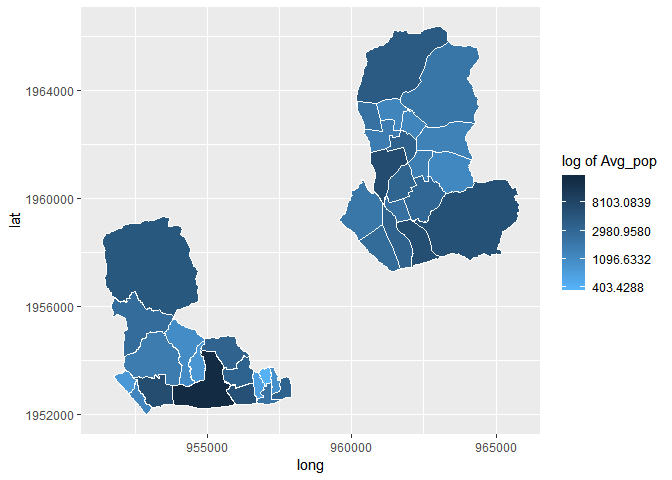

``` r
SK_Age_Modified %>%
  mutate(HDONG_CD = as.numeric(HDONG_CD)) %>%
  group_by(HDONG_CD, AGE_CTG) %>%
  summarise(Avg = mean(Avg_pop)) %>%
  group_by(HDONG_CD) %>%
  filter(Avg == max(Avg)) %>%
  left_join(HDONG_map, by = "HDONG_CD") %>%
  ggplot() +
  geom_polygon(aes(x = long, y = lat, fill = AGE_CTG, group = id), color = "white") 
```

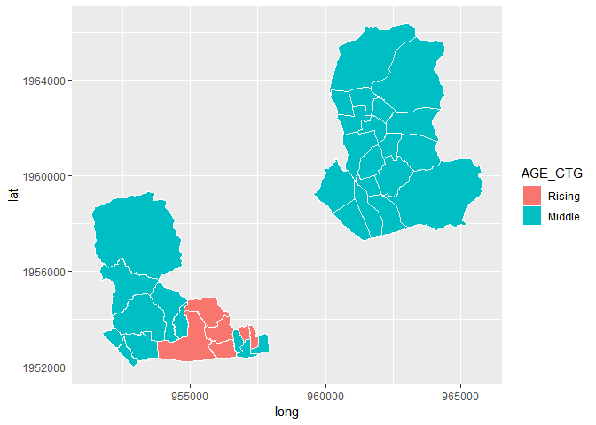

``` r
SK_Age_Modified %>%
  mutate(HDONG_CD = as.numeric(HDONG_CD)) %>%
  group_by(HDONG_CD, Sex) %>%
  summarise(Avg = mean(Avg_pop)) %>%
  filter(Avg == max(Avg)) %>%
  left_join(HDONG_map, by = "HDONG_CD") %>%
  ggplot() +
  geom_polygon(aes(x = long, y = lat, fill = Sex, group = id), color = "white")
```

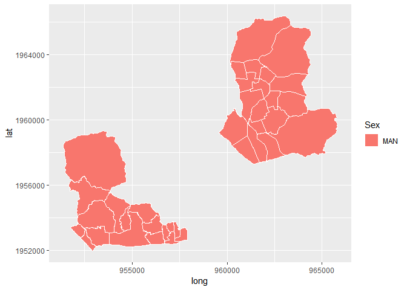

``` r
SK_Time_Modified <- SK_Time %>% 
  lapply(FUN = function(x) x %>%
           gather(key = "Time", value = "Avg_pop", -STD_YM, -STD_YMD, -HDONG_CD, -HDONG_NM) %>%
           mutate(Time = parse_number(Time), Avg_pop = as.numeric(Avg_pop))) %>%
  bind_rows() %>%
  mutate(Week_Day = strftime(STD_YMD, "%a"), 
         HDONG_CD = str_remove_all(HDONG_CD, pattern = DGT %R% DGT %R% END))
```

``` r
Dawn <- 0:5
Rush_Hour <- c(6:9, 17:19)
Afternoon <- 10:16
Evening <- 20:24

SK_Time_Modified %>%
  mutate(Time_CTG = case_when(Time < 6 ~ "Dawn", 
                              Time %in% Rush_Hour ~ "Rush_Hour", 
                              Time %in% Afternoon ~ "Afternoon", 
                              Time %in% Evening ~ "Evening"), 
         Day_CTG = case_when(Week_Day %in% c("토", "일") ~ "Holiday", 
                             Week_Day %in% c("월", "화", "수", "목", "금") ~ "Week"), 
         HDONG_CD = as.numeric(HDONG_CD)) %>%
  filter(Day_CTG == "Week") %>%
  group_by(HDONG_CD, Time_CTG) %>%
  summarise(Mean = mean(Avg_pop)) %>%
  left_join(HDONG_map, by = "HDONG_CD") %>%
  ggplot() +
  geom_polygon(aes(x = long, y = lat, group = id, fill = Mean), color = "white") +
  scale_fill_gradient(name = "Avg_pop of Weekday", low = "#56B1F7", high = "#132B43") +
  facet_wrap(~Time_CTG, nrow = 2) 
```

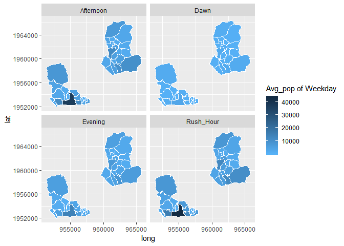

``` r
SK_Time_Modified %>%
  mutate(Time_CTG = case_when(Time < 6 ~ "Dawn", 
                              Time %in% Rush_Hour ~ "Rush_Hour", 
                              Time %in% Afternoon ~ "Afternoon", 
                              Time %in% Evening ~ "Evening"), 
         Day_CTG = case_when(Week_Day %in% c("토", "일") ~ "Holiday", 
                             Week_Day %in% c("월", "화", "수", "목", "금") ~ "Week"), 
         HDONG_CD = as.numeric(HDONG_CD)) %>%
  filter(Day_CTG == "Holiday") %>%
  group_by(HDONG_CD, Time_CTG) %>%
  summarise(Mean = mean(Avg_pop)) %>%
  left_join(HDONG_map, by = "HDONG_CD") %>%
  ggplot() +
  geom_polygon(aes(x = long, y = lat, group = id, fill = Mean), color = "white") +
  scale_fill_gradient(name = "Avg_pop of Holiday", low = "#56B1F7", high = "#132B43") +
  facet_wrap(~Time_CTG, nrow = 2) 
```

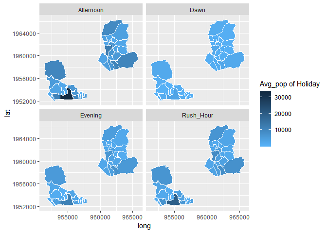

``` r
SK_Time_Modified %>%
  mutate(Time_CTG = case_when(Time < 6 ~ "Dawn", 
                              Time %in% Rush_Hour ~ "Rush_Hour", 
                              Time %in% Afternoon ~ "Afternoon", 
                              Time %in% Evening ~ "Evening"), 
         Day_CTG = case_when(Week_Day %in% c("토", "일") ~ "Holiday", 
                             Week_Day %in% c("월", "화", "수", "목", "금") ~ "Week"), 
         HDONG_CD = as.numeric(HDONG_CD)) %>%
  group_by(HDONG_CD, Day_CTG) %>%
  summarise(Avg = mean(Avg_pop)) %>%
  left_join(HDONG_map, by = "HDONG_CD") %>%
  ggplot() +
  geom_polygon(aes(x = long, y = lat, group = id, fill = Avg)) +
  scale_fill_gradient(name = "Avg_pop", trans = "log", low = "#56B1F7", high = "#132B43") +
  facet_grid(~Day_CTG)
```

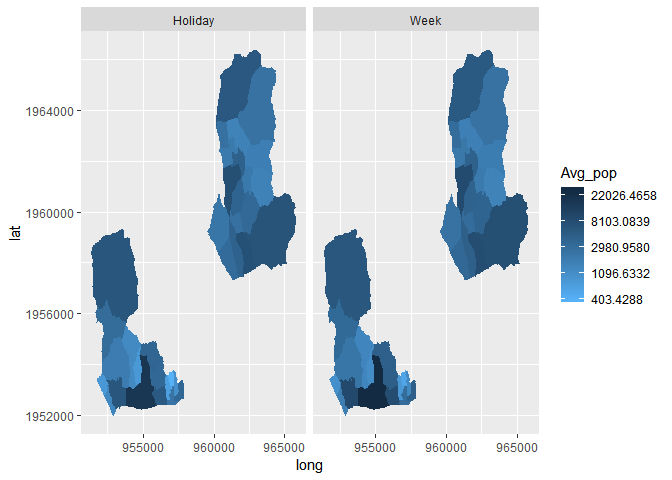

큰 차이 없어 보임.

``` r
SK_Age_Modified %>%
  mutate(Dust_Warn = ifelse(STD_YMD %in% Dust_Warning$Day, "DUST_WARN", "NO_WARN"), 
         HDONG_CD = as.numeric(HDONG_CD)) %>%
  group_by(HDONG_CD, Dust_Warn) %>%
  summarise(Avg = mean(Avg_pop)) %>%
  left_join(HDONG_map, by = "HDONG_CD") %>%
  ggplot() +
  geom_polygon(aes(x = long, y = lat, group = group, fill = Avg)) +
  scale_fill_gradient(name = "Avg_pop", trans = "log", low = "#56B1F7", high = "#132B43") +
  facet_grid(~ Dust_Warn)
```

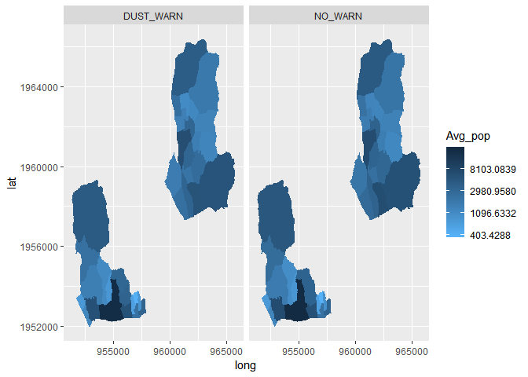

``` r
SK_Time_Modified %>%
  mutate(Time_CTG = case_when(Time < 6 ~ "Dawn", 
                              Time %in% Rush_Hour ~ "Rush_Hour", 
                              Time %in% Afternoon ~ "Afternoon", 
                              Time %in% Evening ~ "Evening"), 
         Day_CTG = case_when(Week_Day %in% c("토", "일") ~ "Holiday", 
                             Week_Day %in% c("월", "화", "수", "목", "금") ~ "Week"), 
         HDONG_CD = as.numeric(HDONG_CD), 
         Dust_Warn = ifelse(STD_YMD %in% Dust_Warning$Day, "DUST_WARN", "NO_WARN")) %>%
  group_by(HDONG_CD, Dust_Warn, Day_CTG) %>%
  summarise(Avg = mean(Avg_pop)) %>%
  left_join(HDONG_map, by = "HDONG_CD") %>%
  ggplot() +
  geom_polygon(aes(x = long, y = lat, group = group, fill = Avg)) +
   scale_fill_gradient(name = "Avg_pop", trans = "log", low = "#56B1F7", high = "#132B43") + 
  facet_wrap(~Dust_Warn + Day_CTG, nrow = 2)
```

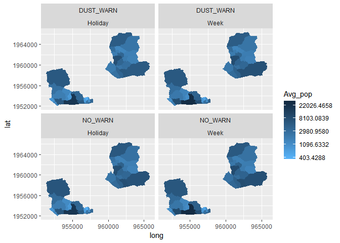

SH Card
=======

``` r
Rising <- c(25, 30, 35)
Middle <- c(40, 45, 50, 55)
Senior <- c(60, 65)

Card <- Card %>%
  mutate(AGE = case_when(AGE_CD == 20 ~ "Youth", 
                         AGE_CD %in% Rising ~ "Rising", 
                         AGE_CD %in% Middle ~ "Middle", 
                         AGE_CD %in% Senior ~ "Senior"), 
         AGE = factor(AGE, levels = c("Youth", "Rising", "Middle", "Senior"))) %>%
  group_by(STD_DD)
```

``` r
Card_Modified <- Card %>% 
  separate(HDONG_CD, into = c("GU_CD", "DONG_CD"), sep = 3) %>%
  mutate(GU_CD = recode(GU_CD, "110" = "1111", "350" = "1135")) %>%
  unite(HDONG_CD, GU_CD, "DONG_CD", sep = "")

Card_Smr <- Card_Modified %>%
  group_by(HDONG_CD) %>%
  summarise(SUM_CNT = sum(USE_CNT), SUM_AMT = sum(USE_AMT), MODE_CAT = Mode(MCT_CAT_CD), 
            Avg_CNT = mean(USE_CNT), AVg_AMT = mean(USE_AMT)) %>%
  mutate(HDONG_CD = as.numeric(HDONG_CD)) %>%
  left_join(MCT_CAT_CD, by = c("MODE_CAT" = "MCT_CD")) 
  
Card_Sum_Coord <- Card_Smr %>% 
  left_join(y = HDONG_map, by = "HDONG_CD")


HDONG_map %>%
  ggplot() +
  geom_polygon(data = Card_Sum_Coord , aes(x = long, y = lat, group = group, fill = SUM_CNT), 
               color = "#FFFFFF") +
  scale_fill_gradient(name = "총 결제 횟수", trans = "log", low = "#56B1F7", high = "#132B43")
```

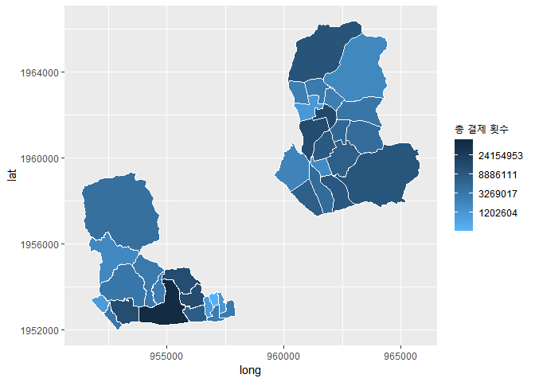

``` r
Card_Modified %>% 
  mutate(HDONG_CD = as.numeric(HDONG_CD), 
         Dust_Warn = ifelse(STD_DD %in% Dust_Warning$Day, "DUST_WARN", "NO_WARN")) %>%
  group_by(HDONG_CD, Dust_Warn) %>%
  summarise(Avg_CNT = mean(USE_CNT)) %>%
  left_join(HDONG_map, by = "HDONG_CD") %>%
  ggplot() +
  geom_polygon(aes(x = long, y = lat, group = group, fill = Avg_CNT)) +
  scale_fill_gradient(name = "Avg_CNT", trans = "log", low = "#56B1F7", high = "#132B43") +
  facet_grid(~Dust_Warn)
```

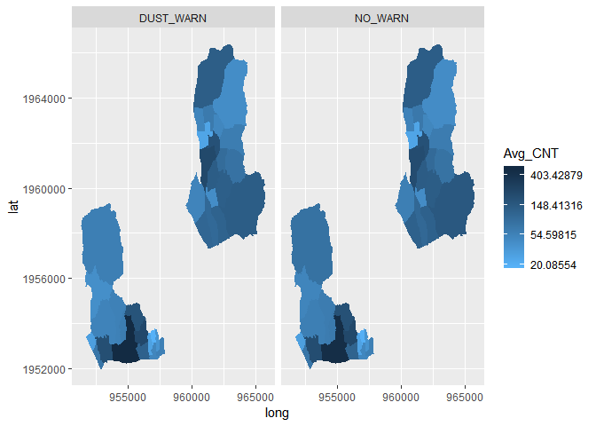

지도에서 찾아내기는 힘든 듯… 범위가 너무 다양해서 미세먼지 경보 유무에
따른 차이를 한눈에 파악하기가 힘듦.

``` r
Card_Sum_Coord %>%
  ggplot() +
  geom_polygon(aes(x = long, y = lat, group = group, fill = SUM_AMT), color = "#FFFFFF") +
  scale_fill_gradient(name = "매출액 총합", trans = "log", low = "#56B1F7", high = "#132B43")
```


``` r
Card_Modified %>%
  mutate(MCT_CAT_CD = as.character(MCT_CAT_CD), 
         HDONG_CD = as.numeric(HDONG_CD)) %>%
  group_by(HDONG_CD, MCT_CAT_CD) %>%
  summarise(SUM_CNT = sum(USE_CNT)) %>%
  filter(SUM_CNT == max(SUM_CNT)) %>%
  left_join(MCT_CAT_CD, by = c("MCT_CAT_CD" = "MCT_CD")) %>%
  left_join(y = HDONG_map, by = "HDONG_CD") %>%
  ggplot() +
  geom_polygon(aes(x = long, y = lat, fill = MCT_NM, group = group), color = "white") +
  ggtitle("지역별 최다 횟수 업종")
```


-   서적문구 : 평창동

-   의료기관 : 교남동 (강북삼성병원, 서울적십자병원)

-   요식업소 : 삼청동, 가회동, 명륜3가동/혜화동, 사직동,
    종로1,2,3,4가동, 종로5,6가동, 이화동, 창신3동, 창신1동

-   연료판매 : 상계 6,7동

``` r
Card_Modified %>%
  mutate(MCT_CAT_CD = as.character(MCT_CAT_CD), 
         HDONG_CD = as.numeric(HDONG_CD)) %>%
  group_by(HDONG_CD, AGE) %>%
  summarise(SUM_CNT = sum(USE_CNT)) %>%
  filter(SUM_CNT == max(SUM_CNT)) %>%
  left_join(y = HDONG_map, by = "HDONG_CD") %>%
  ggplot() +
  geom_polygon(aes(x = long, y = lat, fill = AGE, group = group), color = "white") +
  ggtitle("지역별 최다 지출 건수 연령")
```

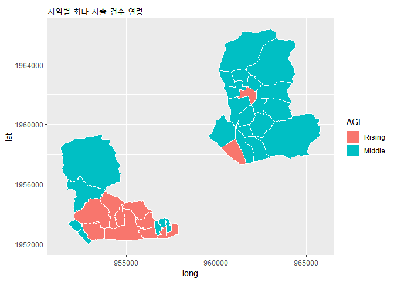

``` r
Card_Modified %>%
  mutate(MCT_CAT_CD = as.character(MCT_CAT_CD), 
         HDONG_CD = as.numeric(HDONG_CD)) %>%
  group_by(HDONG_CD, SEX_CD) %>%
  summarise(SUM_CNT = sum(USE_CNT)) %>%
  filter(SUM_CNT == max(SUM_CNT)) %>%
  left_join(y = HDONG_map, by = "HDONG_CD") %>%
  ggplot() +
  geom_polygon(aes(x = long, y = lat, fill = SEX_CD, group = group), color = "white") +
  ggtitle("지역별 최다 지출 건수 성별")
```

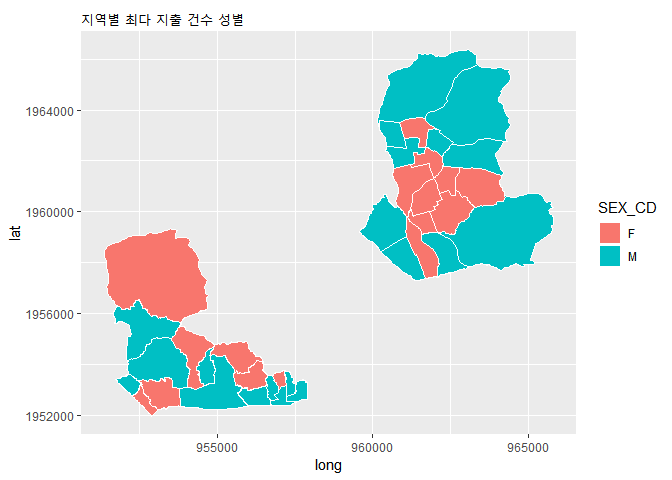

GS
==

``` r
Dist %>%
  mutate(Real_Value = AMT_IND * value, 
         ADMD_CD = as.numeric(ADMD_CD)) %>%
  group_by(ADMD_CD, Category) %>%
  summarise(SUM_Value = sum(Real_Value, na.rm = TRUE)) %>%
  left_join(Dist_Category, by = c("Category" = "CTG_CD")) %>%
  filter(SUM_Value == max(SUM_Value)) %>%
  left_join(HDONG_map, by = c("ADMD_CD" = "HDONG_CD")) %>%
  ggplot() +
  geom_polygon(aes(x = long, y = lat, group = group, fill = CTG_NM), color = "white")
```

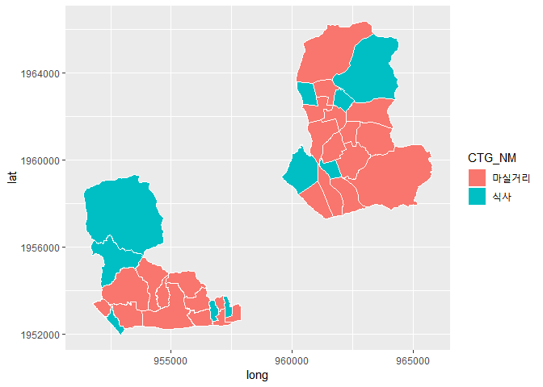

``` r
Dist %>%
  group_by(OPER_DT, ADMD_CD) %>%
  filter(Category == first(Category, 1)) %>%
  group_by(ADMD_CD) %>%
  summarise(AVG_IND = mean(AMT_IND)) %>%
  mutate(ADMD_CD = as.numeric(ADMD_CD)) %>%
  left_join(y = HDONG_map, by = c("ADMD_CD" = "HDONG_CD")) %>%
  ggplot() +
  geom_polygon(aes(x = long, y = lat, group = id, fill = AVG_IND), color = "white") +
  scale_fill_gradient(name = "연평균 매출 지수", low = "#56B1F7", high = "#132B43")
```


상계 6,7동의 4/12일이 매출 기준일.
