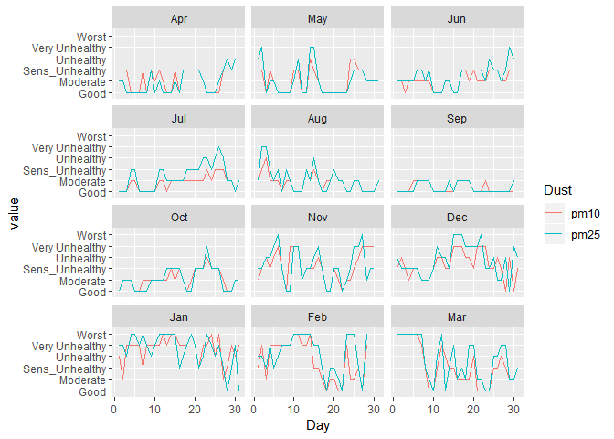
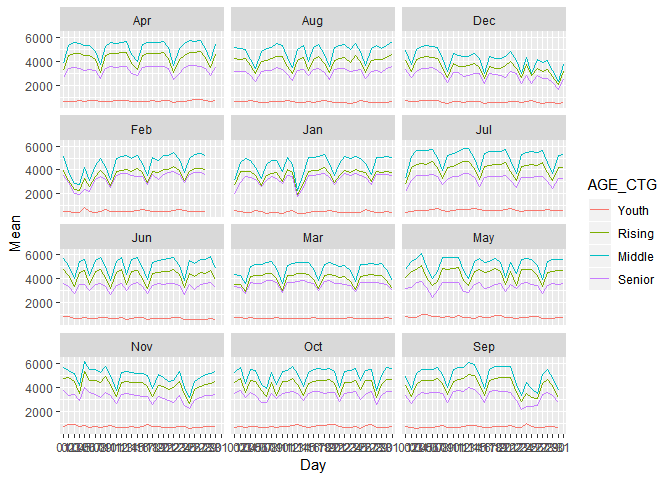
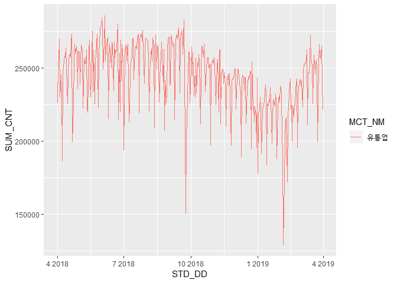

``` r
library(tidyverse)
library(ggplot2)
library(lubridate)
library(rebus)
library(KoNLP)
library(reshape2)
library(wordcloud2)
library(rJava)
library(KoSpacing)
load("Data_Cleansing.RData")
useSejongDic()
```

    ## Backup was just finished!
    ## 370957 words dictionary was built.

``` r
useNIADic()
```

    ## Backup was just finished!
    ## 983012 words dictionary was built.

0. Weather
==========

K-Weather에서 제공한 날씨 데이터.

``` r
Dust_lev <- c("Good", "Moderate", "Sens_Unhealthy", "Unhealthy", "Very Unhealthy", "Worst")

Weather <- Wth_Jongno[[12]] %>%
  mutate(pm10 = as.numeric(pm10), 
         pm25 = as.numeric(pm25), 
         pm10 = case_when((pm10 <= 30) ~ "Good", 
                          (pm10>30 & pm10<=50) ~ "Moderate", 
                          (pm10>50 & pm10<=75) ~ "Sens_Unhealthy", 
                          (pm10>75 & pm10<=100) ~ "Unhealthy", 
                          (pm10>100 & pm10<=150) ~ "Very Unhealthy", 
                          (pm10>150) ~ "Worst"), 
         pm25 = case_when((pm25 <= 15) ~ "Good", 
                          (pm25>15 & pm25<=25) ~ "Moderate", 
                          (pm25>25 & pm25<=37) ~ "Sens_Unhealthy", 
                          (pm25>37 & pm25<=50) ~ "Unhealthy", 
                          (pm25>50 & pm25<=75) ~ "Very Unhealthy", 
                          (pm25>75) ~ "Worst")) %>%
  separate(col = Day, into = c("Year", "Month", "Day")) %>%
  group_by(Year, Month, Day)

Smr_Wth <- Weather %>%
  summarise(pm10 = which.max(table(pm10)) %>% names(), 
            pm25 = which.max(table(pm25)) %>% names(), 
            avg_noise = mean(noise), 
            avg_temp = mean(temp), 
            avg_humi = mean(humi)) %>%
  mutate(pm10 = factor(pm10, levels = Dust_lev), 
         pm25 = factor(pm25, levels = Dust_lev)) %>%
  ungroup() %>%
  mutate(Month = month.abb[as.numeric(Month)] %>%
           factor(levels = c("Apr", "May", "Jun", "Jul", "Aug", "Sep", 
                             "Oct", "Nov", "Dec", "Jan", "Feb", "Mar")))
```

Select the machine (serial == V10O1611170) which has 365 Day data in
Wth\_Jongno. summarise the Data with mode(pm10, pm25), average(noise,
temp, humi) “미세미세” 어플 기준으로 구간 배정. 구간 중 최빈값을 하루를
대표하는 값으로 설정.

``` r
Smr_Wth %>%
  gather(key = "Dust", value = "value", pm10, pm25) %>%
  mutate(Day = as.numeric(Day)) %>%
  ggplot() +
  geom_line(aes(x = Day, y = value, group = Dust, color = Dust)) +
  facet_wrap(~Month, nrow = 4, ncol = 3)
```



pm10 is almost Good-Modertate, Sometimes Unhealthy. pm25 is Unhealthy in
Dec-Jan-Feb

``` r
Classify_Wrn_Day <- function(x) {
  if("Dust_Watch" %in% x) {
    return("Dust_Watch")
  } else if("Warning" %in% x) {
    return("Warning")
  } else {return("No_Wrn")}
}
```

``` r
Wth_Obs <- Wth_Jongno[[12]] 
Wrn_lev <- c("No_Wrn", "Warning", "Dust_Watch")

Dust_Wrn <- Wth_Obs %>%
  separate(Hour, into = c("Hour", "Minute"), 2) %>%
  mutate(pm10 = as.numeric(pm10), pm25 = as.numeric(pm25)) %>%
  group_by(Day, Hour) %>%
  summarise(pm10 = mean(pm10), pm25 = mean(pm25)) %>%
  mutate(pm10 = case_when((pm10 < 150) ~ "No_Wrn", 
                          (pm10 >= 150 & pm10 < 300) ~ "Warning", 
                          (pm10 >= 300) ~ "Dust_Watch"), 
         pm25 = case_when((pm25 < 75) ~ "No_Wrn", 
                          (pm10 >= 75 & pm10 < 150) ~ "Warning", 
                          (pm10 >= 150) ~ "Dust_Watch")) %>%
  ungroup() %>%
  mutate(pm10_Pre = lag(pm10), 
         pm25_Pre = lag(pm25), 
         pm10_Wrn = ifelse(pm10 == pm10_Pre, pm10, "Not"), 
         pm25_Wrn = ifelse(pm25 == pm25_Pre, pm25, "Not")) %>%
  group_by(Day) %>%
  summarise(pm10 = Classify_Wrn_Day(pm10_Wrn), 
            pm25 = Classify_Wrn_Day(pm25_Wrn))
```

pm10, pm25의 시간별 평균 미세먼지 농도를 구한 후, 세가지 단계로 분류
pm10의 시간 평균농도가 150이상이 두시간 지속이면 미세먼지 주의보, pm10의
시간 평균농도가 300이상이 두시간 지속이면 미세먼지 경보.

pm25의 시간 평균농도가 75이상이 두시간 지속이면 초미세먼지 주의보,
pm25의 시간 평균농도가 150이상이 두시간 지속이면 초미세먼지 경보 발령.
(대전광역시 보건환경연구원 기준)

``` r
Dust_Wrn %>%
  gather(key = "Warning", value = "value", -Day) %>%
  mutate(value = factor(value, levels = Wrn_lev)) %>%
  separate(Day, into = c("Year", "Month", "Day")) %>%
  mutate(Month = month.abb[as.numeric(Month)] %>%
           factor(levels = c("Apr", "May", "Jun", "Jul", "Aug", "Sep", 
                             "Oct", "Nov", "Dec", "Jan", "Feb", "Mar")), 
         Day = as.numeric(Day)) %>%
  ggplot() +
  geom_line(aes(x = Day, y = value, group = Warning, color = Warning)) +
  facet_wrap(~Month, nrow = 4)
```


12/15 -3/12 초미세먼지 경보 지속적으로 발령 12-3월까지는 미세먼지 영향권

1. SK
=====

SK에서 제공한 유동인구 데이터(미완)

``` r
SK_Age[[5]] %>% 
  gather(key = "Type", value = "Avg_pop", -STD_YM, -STD_YMD, -HDONG_CD, -HDONG_NM) %>%
  separate(Type, into = c("Sex", "Age"), sep = "_FLOW_POP_CNT_") %>%
  mutate(Date = as.Date(STD_YMD), 
         Avg_pop = as.numeric(Avg_pop)) %>%
  group_by(STD_YMD, Sex) %>%
  summarise(SUM = sum(Avg_pop))
```

Date, Sex로 하고 Avg\_pop을 더하면 정수가 나온다.

Avg\_pop 구하는 데에 연관이 있을 것으로 사료됨.

``` r
ggplot(APR %>% filter(HDONG_CD == "1111061500")) +
  geom_line(aes(x = Date, y = Avg_pop, group = Age, color = Age)) +
  scale_y_log10() +
  facet_wrap(~Sex, ncol = 1)  +
  ggtitle("종로1,2,3,4가동 4월 유동인구")
```

1111061500 is code for “종로1,2,3,4가동” Youth is dropped because It is
too samll.

``` r
APR_Time <- SK_Time[[1]]

APR_Time %>% filter(HDONG_CD == "1111061500", 
                    STD_YMD %in% c("2018-04-11", "2018-04-14", "2018-04-15")) %>%
  gather(key = "Time", value = "Avg_pop", -STD_YM, -STD_YMD, -HDONG_CD, -HDONG_NM) %>%
  mutate(Time = parse_number(Time), Avg_pop = as.numeric(Avg_pop)) %>%
  ggplot() +
  geom_line(aes(x = Time, y = Avg_pop, group = STD_YMD, color = STD_YMD)) +
  scale_y_log10() +
  guides(color = guide_legend(title = "Day"))
```



2018-04-11 is WED. 2018-04-14 is SAT 2018-04-15 is SUN

``` r
APR_Time <- SK_Time[[1]]

APR_Time %>%
  gather(key = "Time", value = "Avg_pop", -STD_YM, -STD_YMD, -HDONG_CD, -HDONG_NM) %>%
  mutate(Time = parse_number(Time), Avg_pop = as.numeric(Avg_pop), 
         Week_Day = strftime(STD_YMD, "%a")) %>%
  group_by(STD_YMD) %>%
  summarise(Sum = sum(Avg_pop))
```

-\> STD\_YMD로 grouping하고 sum하면 정수가 나온다…?

-   Avg\_pop 계산하는 거 구해서 요일별/시간대별로 line 찍기

2. Card
=======

신한카드에서 제공한 카드 매출 데이터.

``` r
Rising <- c(25, 30, 35)
Middle <- c(40, 45, 50, 55)
Senior <- c(60, 65)

Card <- Card %>%
  mutate(AGE = case_when(AGE_CD == 20 ~ "Youth", 
                         AGE_CD %in% Rising ~ "Rising", 
                         AGE_CD %in% Middle ~ "Middle", 
                         AGE_CD %in% Senior ~ "Senior"), 
         AGE = factor(AGE, levels = c("Youth", "Rising", "Middle", "Senior"))) %>%
  group_by(STD_DD)
```

Separate Age\_Type with (Youth, Rising, Middle, Senior)

``` r
Smr_Card <- Card %>%
  separate(STD_DD, into = c("YEAR", "MONTH", "DAY")) %>%
  mutate(MONTH = month.abb[as.numeric(MONTH)] %>%
           factor(levels = c("Apr", "May", "Jun", "Jul", "Aug", "Sep", 
                             "Oct", "Nov", "Dec", "Jan", "Feb", "Mar")), 
         MCT_CAT_CD = as.character(MCT_CAT_CD)) %>%
  group_by(YEAR, MONTH, DAY, MCT_CAT_CD) %>%
  summarise(SUM_CNT = sum(USE_CNT), SUM_AMT = sum(USE_AMT)) %>%
  group_by(YEAR, MONTH, DAY) 
```

``` r
EFF_MCT_CAT <- c("21", "40", "34", "50", "42", "62")
DUST_EFF_MTH <- c("Dec", "Jan", "Feb", "Mar")


left_join(Smr_Card, MCT_CAT_CD, by = c("MCT_CAT_CD" = "MCT_CD")) %>%
  mutate(DUST_EFF = ifelse(MONTH %in% DUST_EFF_MTH, "DUST_EFF_MTH", "NO_EFF_MTH")) %>%
  filter(MCT_CAT_CD %in% EFF_MCT_CAT) %>%
  ungroup() %>%
  mutate(DAY = as.numeric(DAY)) %>%
  ggplot() +
  geom_line(aes(x = DAY, y = SUM_CNT, group = MONTH, color = DUST_EFF)) +
   facet_wrap(~MCT_NM, nrow = 2, ncol = 3, scales = "free") +
  scale_y_log10()
```


미세먼지 영향권 달에 (광학제품, 레저업소, 서적문구) 는 매출건이 많고,
(유통업, 의복, 자동차 정비)는 건수가 줄어든다.

미세먼지 영향권 달을 12-3월로 규정한 만큼, 기온과 신학기의 상관관계를
주의하여 밝힐 것.

``` r
left_join(Smr_Card, MCT_CAT_CD, by = c("MCT_CAT_CD" = "MCT_CD")) %>%
  mutate(DUST_EFF = ifelse(MONTH %in% DUST_EFF_MTH, "DUST_EFF_MTH", "NO_EFF_MTH")) %>%
  filter(MCT_CAT_CD %in% EFF_MCT_CAT) %>%
  ungroup() %>%
  mutate(DAY = as.numeric(DAY)) %>%
  ggplot() +
  geom_line(aes(x = DAY, y = SUM_AMT, group = MONTH, color = DUST_EFF)) +
   facet_wrap(~MCT_NM, nrow = 2, ncol = 3, scales = "free") +
  scale_y_log10()
```


``` r
Card %>%
  group_by(STD_DD, MCT_CAT_CD) %>%
  summarise(SUM_CNT = sum(USE_CNT), SUM_AMT = sum(USE_AMT)) %>%
  mutate(MCT_CAT_CD = as.character(MCT_CAT_CD)) %>%
  left_join(y = MCT_CAT_CD, by = c("MCT_CAT_CD" = "MCT_CD")) %>%
  filter(MCT_CAT_CD == 40) %>%
  ungroup() %>%
  mutate(STD_DD = as.Date(STD_DD)) %>%
  ggplot() +
  geom_line(aes(x = STD_DD, y = SUM_CNT, group = MCT_NM, color = MCT_NM))
```


(유통업) 12-3월까지 낮다.

``` r
Card %>%
  group_by(STD_DD, MCT_CAT_CD) %>%
  summarise(SUM_CNT = sum(USE_CNT), SUM_AMT = sum(USE_AMT)) %>%
  mutate(MCT_CAT_CD = as.character(MCT_CAT_CD)) %>%
  left_join(y = MCT_CAT_CD, by = c("MCT_CAT_CD" = "MCT_CD")) %>%
  filter(MCT_CAT_CD == 50) %>%
  ungroup() %>%
  mutate(STD_DD = as.Date(STD_DD)) %>%
  ggplot() +
  geom_line(aes(x = STD_DD, y = SUM_CNT, group = MCT_NM, color = MCT_NM))
```


서적 / 문구는 미세먼지 기간에 살짝 높다.

``` r
Card %>%
  group_by(STD_DD, MCT_CAT_CD) %>%
  summarise(SUM_CNT = sum(USE_CNT), SUM_AMT = sum(USE_AMT)) %>%
  mutate(MCT_CAT_CD = as.character(MCT_CAT_CD)) %>%
  left_join(y = MCT_CAT_CD, by = c("MCT_CAT_CD" = "MCT_CD")) %>%
  filter(MCT_CAT_CD == 34) %>%
  ungroup() %>%
  mutate(STD_DD = as.Date(STD_DD)) %>%
  ggplot() +
  geom_line(aes(x = STD_DD, y = SUM_CNT, group = MCT_NM, color = MCT_NM))
```


광학은 미세먼지 기간에 살짝 높다.

``` r
Card %>%
  group_by(STD_DD, MCT_CAT_CD) %>%
  summarise(SUM_CNT = sum(USE_CNT), SUM_AMT = sum(USE_AMT)) %>%
  mutate(MCT_CAT_CD = as.character(MCT_CAT_CD)) %>%
  left_join(y = MCT_CAT_CD, by = c("MCT_CAT_CD" = "MCT_CD")) %>%
  filter(MCT_CAT_CD %in% c(21, 42, 62)) %>%
  ungroup() %>%
  mutate(STD_DD = as.Date(STD_DD)) %>%
  ggplot() +
  geom_line(aes(x = STD_DD, y = SUM_CNT, group = MCT_NM, color = MCT_NM))
```



레저는 미세먼지 기간에 살짝 높고, 자동차 정비는 줄고, 의복도 약간 준다.

``` r
Card %>%
  group_by(STD_DD, MCT_CAT_CD, SEX_CD, AGE) %>%
  summarise(SUM_CNT = sum(USE_CNT), 
            SUM_AMT = sum(USE_AMT)) %>%
  ungroup() %>%
  mutate(MCT_CAT_CD = as.character(MCT_CAT_CD)) %>%
  left_join(y = MCT_CAT_CD, by = c("MCT_CAT_CD" = "MCT_CD")) %>%
  filter(MCT_CAT_CD == 21) %>%
  mutate(STD_DD = as.Date(STD_DD)) %>%
  ggplot() +
  geom_line(aes(x = STD_DD, y = SUM_CNT, group = AGE, color = AGE)) +
  facet_wrap(~SEX_CD, nrow = 2) +
  scale_y_log10()
```


미세먼지 영향권에서 YOUTH들의 유통업, 자동차 정비건수가 줄어든다.
레저업소, 광학, 서적문구(3월 제외), 의복, 는 보통… 차이 없음 레저업소는
Senior에서 미세먼지 없을 때 줄어듬

3. GS (Distribution)
====================

GS에서 제공한 유통데이터.

``` r
Real_Dist <- Dist %>%
  group_by(OPER_DT, ADMD_CD) %>%
  mutate(Real_Value = value * AMT_IND) 
```

``` r
Real_Dist %>%
  left_join(y = Dist_Category, by = c("Category" = "CTG_CD")) %>%
  group_by(ADMD_CD, Category) %>%
  mutate(OPER_DT = as.Date(OPER_DT), 
         DIFF = c(NA, diff(Real_Value))) %>%
  filter(complete.cases(DIFF), 
         Category == 80) %>%
  ggplot() +
  geom_line(aes(x = OPER_DT, y = DIFF)) +
  facet_wrap(~BOR_CD, nrow = 2, scales = "free")
```


간식 : 미세먼지 기간에 종로에서 Variation 감소

식사 : 미세먼지 기간에 전체적으로 피크

마실거리 : 미세먼지 기간에 노원구에서 Variation 감소

홈/리빙 : 특별한 점 없음

헬스/뷰티 : 종로 미세먼지 떄 분산 감소. 노원, outlier

취미/여가 : 분산 감소 (특히 종로)

사회활동 : 특별한 점 없음

임신 / : 미세먼지 기간에 분산 감소.

------------------------------------------------------------------------

``` r
Real_Dist %>%
  group_by(OPER_DT, BOR_CD, Category) %>%
  summarise(Avg_Value = mean(Real_Value, na.rm = T)) %>%
  left_join(y = Dist_Category, by = c("Category" = "CTG_CD")) %>%
  ungroup() %>%
  mutate(OPER_DT = as.Date(OPER_DT)) %>%
  filter(Category == 80) %>%
  ggplot() +
  geom_line(aes(x = OPER_DT, y = Avg_Value, group = CTG_NM, color = CTG_NM)) +
  facet_wrap(~BOR_CD, nrow = 2, scales = "free")
```


-   1.  식사 : 종로에서는 미세먼지 기간에 다소 감소(피크 1번) 노원에서는
        미세먼지 좋을 때, 매출 증가

-   1.  간식 : 11/11, 3/14, 2/14에 피크 종로/노원구 둘 다 미세먼지
        기간에 감소한 것으로 보임.

-   1.  마실거리 : 종로/노원 둘 다 미세먼지 기간에 감소한 것으로 보임.
        미세먼지가 좋을 때는 매출 증가

-   1.  홈/리빙 : 종로/노원 그래프가 다소 다른 양상. (노원에서 1/28,
        10/23, 7/9 피크) 종로에서 미세먼지 기간에 감소.

-   1.  헬스/뷰티 : 종로에서는 미세먼지 기간에 감소 뚜렷. 노원구는
        뚜렷한 증상 없음.

-   1.  취미/여가활동 : 5/8일에 종로/노원에서 피크. 노원에서는 5/30에
        살짝 피크 그 외 뚜렷한 증상 없음.

-   1.  사회활동 : 종로에서 다소 미세먼지 기간에 감소 추세 그 외 뚜렷한
        증상 없음.

-   1.  임신/육아 : 종로/노원에서 미세먼지 기간에 감소추세 뚜렷.

``` r
Real_Dist %>%
  group_by(OPER_DT, Category) %>%
  summarise(Avg_Value = mean(Real_Value, na.rm = T)) %>%
  separate(OPER_DT, into = c("Year", "Month", "Day")) %>%
  mutate(Month = month.abb[as.numeric(Month)] %>%
           factor(levels = c("Apr", "May", "Jun", "Jul", "Aug", "Sep", 
                             "Oct", "Nov", "Dec", "Jan", "Feb", "Mar")), 
         DUST_EFF = ifelse(Month %in% DUST_EFF_MTH, "DUST_EFF_MTH", "NO_EFF_MTH")) %>%
  left_join(y = Dist_Category, by = c("Category" = "CTG_CD")) %>%
  mutate(Day = as.numeric(Day)) %>%
  ggplot() +
  geom_line(aes(x = Day, y = Avg_Value, group = Month, color = DUST_EFF)) +
  facet_wrap(~CTG_NM, nrow = 4, scales = "free")
```


마실거리, 식사, 임신/육아가 뚜렷하게 미세먼지 기간에 감소

4. SNS
======

와이즈넛에서 제공한 SNS 데이터.

``` r
SNS_Dust <- list()
Dust_Word <- c("미세" %R% optional(SPC) %R% "먼지")

for(i in 1:length(SNS)) {
  Data <- SNS[[i]]
  idx <- which(Data$TITLE %>% str_detect(pattern = Dust_Word))
  SNS_Dust[[i]] <- Data[idx, ]
}

SNS_Dust <- SNS_Dust %>% bind_rows()
```

CONTENT로 필터링 하면 미세먼지와 상관 없는 내용도 많음. TITLE에 “미세
먼지”포함한 Row만 필터링.

``` r
pattern_DGT <-  SPC %R% one_or_more(DGT) %R% SPC %R% one_or_more(DGT) %R% SPC %R% 
  one_or_more(DGT) %R% SPC %R% one_or_more(DGT) %R% SPC
  
SNS_Dust <- SNS_Dust %>% 
  mutate(CONTENT = str_remove_all(CONTENT, 
                                  pattern = "URL 복사 이웃추가 본문 기타 기능 번역보기"), 
         CONTENT = str_remove_all(CONTENT, pattern = pattern_DGT))
```

양이 너무 많아서 블로그 / 카페 / 뉴스 별로 나누어서 Word Cloud

4-1. 블로그
-----------

블로그 자료.

``` r
set.seed(0)
Blog <- SNS_Dust %>%
  filter(SECTION == "블로그") 

Blog_Content <- Blog$CONTENT %>% na.omit()

Blog_Pos_tag <- SimplePos09(sample(Blog_Content, size = 3000))
```

261에서 에러 277에서 에러 -\> 띄어쓰기 문제로 에러 메세지 출력.
KoSpacing사용해보려고 했으나 실패. 38526개의 Content vector. 너무 많아서
sampling 3000개만 형태소 분석.

``` r
Blog_Pos_Table <- Blog_Pos_tag %>% 
  unlist %>% unname() %>%
  tbl_df %>% 
  mutate(noun=str_match(value, '([가-힣]+)/N')[,2]) %>%
  na.omit() %>%
  filter(str_length(noun) >= 2) %>%
  count(noun, sort = TRUE) %>%
  filter(!noun == "미세먼지")
```

``` r
Blog_Pos_Table %>% 
  head(100) %>%
  wordcloud2(fontFamily='Noto Sans CJK KR Bold', minRotation = 0, maxRotation = 0)
```

마스크(3637), 피부(2537), 제품(2201), 사용(2024), 때문(1612),
공기(1591), 공기청정기(1587), 오늘(1469), 초미세먼지(1363), 우리(1210),
차량(1170), 시간(1054)

마스크, 피부, 때문, 사용, 공기청정기 등 실제 생활에 있어서 미세먼지
예방과 대책에 초점.

4-2. 카페
---------

카페 자료.

``` r
set.seed(0)
Cafe <- SNS_Dust %>%
  filter(SECTION == "카페")

Cafe_Content <- Cafe$CONTENT %>% na.omit()

Cafe_Pos_tag <- SimplePos09(sample(Cafe_Content, size = 3000))
```

``` r
Cafe_Pos_Table <- Cafe_Pos_tag %>% 
  unlist %>% unname() %>%
  tbl_df %>% 
  mutate(noun=str_match(value, '([가-힣]+)/N')[,2]) %>%
  na.omit() %>%
  filter(str_length(noun) >= 2) %>%
  count(noun, sort = TRUE) %>%
  filter(!noun == "미세먼지")
```

``` r
Cafe_Pos_Table %>% 
  head(100) %>%
  wordcloud2(fontFamily='Noto Sans CJK KR Bold', minRotation = 0, maxRotation = 0)
```

마스크(731), 오늘 (658), 공기(425), 수치(405), 제품(350),
공기청정기(349), 때문(334), 환기(300), 중국(289), 판매(279),
초미세먼지(260), 사용(257), 경우(256), 날씨(254)

블로그와 마찬가지로 실제 생활과 밀접한 단어.

4-3. 뉴스
---------

뉴스 자료

``` r
set.seed(0)
News <- SNS_Dust %>%
  filter(SECTION == "뉴스")

News_Content <- News$CONTENT %>% na.omit()

News_Pos_tag <- SimplePos09(sample(News_Content, size = 3000))
```

``` r
News_Pos_Table <- News_Pos_tag %>% 
  unlist %>% unname() %>%
  tbl_df %>% 
  mutate(noun=str_match(value, '([가-힣]+)/N')[,2]) %>%
  na.omit() %>%
  filter(str_length(noun) >= 2) %>%
  count(noun, sort = TRUE) %>%
  filter(!noun == "미세먼지")
```

``` r
News_Pos_Table %>% 
  head(100) %>%
  wordcloud2(fontFamily='Noto Sans CJK KR Bold', minRotation = 0, maxRotation = 0)
```

농도(3634), 서울(3100), 전국(2393), 초미세먼지(2066), 기자(2027),
기온(1946), 지역(1812), 수준(1762), 오늘(1375), 영향(1356), 예상(1338),
오후(1300), 아침(1229), 날씨(1214), 마스크(1147), 오전(1138),
저감(1053), 중국(968), 대구(953), 부산(923), 광주(878), 대전(849),
제주도(814), 제주(754), 수도권(738), 인천(735), 춘천(582),
공기청정기(573), 전주(567), 강릉(549)

일기예보 영향인지, 지역명 / 시간을 나타내는 단어 다수 출몰. 영향과
예상과 관련된 단어가 다수 보임. 지역명을 제외하고 다시 SNA
