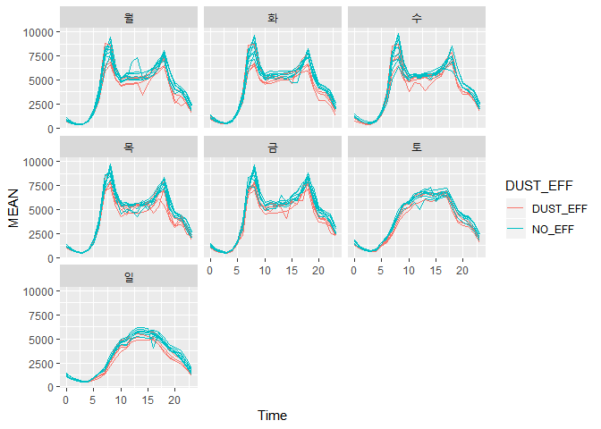
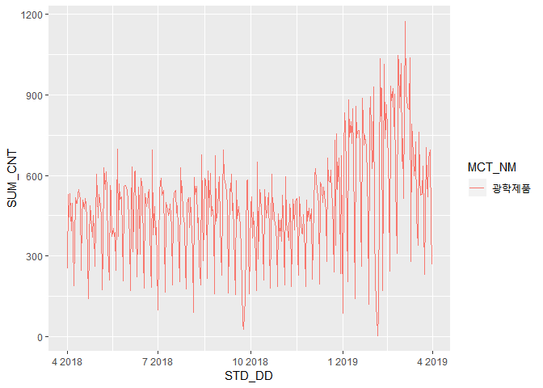

``` r
library(tidyverse)
library(ggplot2)
library(lubridate)
library(rebus)
library(KoNLP)
library(reshape2)
library(wordcloud2)
library(rJava)
library(KoSpacing)
library(igraph)
library(data.table)
library(ggraph)
library(tidygraph)
library(readxl)
load("Data_Cleansing.RData")
Wth_obs <- readRDS("Wth_obs.rds")
source("https://raw.githubusercontent.com/S0Hye0NKim/bigcon/master/bigcon_function.R")
loc_Wth_Jongno <- read_xlsx("04_Innovation 분야_환경기상데이터(케이웨더)_데이터정의서(행정동추가).xlsx", 
                     range = "B1:E32", sheet = 2) 
loc_Wth_Nowon <- read_xlsx("04_Innovation 분야_환경기상데이터(케이웨더)_데이터정의서(행정동추가).xlsx", 
                     range = "H1:K23", sheet = 2) 
loc_Wth <- rbind(loc_Wth_Jongno, loc_Wth_Nowon) %>%
  select(serial = "스테이션", location = "위치", HDONG_NM = "행정동")
useNIADic()
```

    ## Backup was just finished!
    ## 983012 words dictionary was built.

Weather
=======

K-Weather에서 제공한 날씨 데이터.

``` r
Jongno_obs <- Wth_Jongno %>% lapply(FUN = function(x) x %>%
                                        select(-flag, -co2, -vocs) %>% mutate_all(as.character)) %>%
  bind_rows %>% na.omit()

Nowon_obs <- Wth_Nowon %>% lapply(FUN = function(x) x %>% 
                                      select(-flag, -co2, -vocs) %>% mutate_all(as.character))  %>%
  bind_rows()

Wth_obs <- bind_rows(Jongno_obs, Nowon_obs)
```

``` r
DT_Wth_obs <- data.table(Wth_obs)

DT_Wth_CTG <- DT_Wth_obs[, .(Day, Hour, serial, temp, pm10_CTG = Classify_Dust_lev(pm10, tiny = 10), 
               pm25_CTG = Classify_Dust_lev(pm25, tiny = 25)), ]

Wth_obs_CTG <- DT_Wth_CTG[, .(pm10_CTG = Mode(pm10_CTG), pm25_CTG = Mode(pm25_CTG)), by = .(Day)] %>%
  tbl_df
```

``` r
Dust_lev <- c("Good", "Moderate", "Sens_Unhealthy", "Unhealthy", "Very Unhealthy", "Worst")

Weather <- Wth_obs_CTG %>%
  separate(col = Day, into = c("Year", "Month", "Day")) %>%
  group_by(Year, Month, Day)

Smr_Wth <- Weather %>%
  mutate(pm10_CTG = factor(pm10_CTG, levels = Dust_lev), 
         pm25_CTG = factor(pm25_CTG, levels = Dust_lev)) %>%
  ungroup() %>%
  mutate(Month = month.abb[as.numeric(Month)] %>%
           factor(levels = c("Apr", "May", "Jun", "Jul", "Aug", "Sep", 
                             "Oct", "Nov", "Dec", "Jan", "Feb", "Mar")))
```

Select the machine (serial == V10O1611170) which has 365 Day data in
Wth\_Jongno. summarise the Data with mode(pm10, pm25), average(noise,
temp, humi) “미세미세” 어플 기준으로 구간 배정. 구간 중 최빈값을 하루를
대표하는 값으로 설정.

``` r
Smr_Wth %>%
  gather(key = "Dust", value = "value", pm10_CTG, pm25_CTG) %>%
  mutate(Day = as.numeric(Day)) %>%
  ggplot() +
  geom_line(aes(x = Day, y = value, group = Dust, color = Dust)) +
  facet_wrap(~Month, nrow = 4, ncol = 3)
```


pm10 is almost Good-Modertate, Sometimes Unhealthy. pm25 is Unhealthy in
Dec-Jan-Feb

``` r
Classify_Wrn_Day <- function(x) {
  if("Dust_Watch" %in% x) {
    return("Dust_Watch")
  } else if("Warning" %in% x) {
    return("Warning")
  } else {return("No_Wrn")}
}
```

``` r
Wth_Obs <- Wth_Jongno[[12]] 
Wrn_lev <- c("No_Wrn", "Warning", "Dust_Watch")

Dust_Wrn <- Wth_Obs %>%
  separate(Hour, into = c("Hour", "Minute"), 2) %>%
  mutate(pm10 = as.numeric(pm10), pm25 = as.numeric(pm25)) %>%
  group_by(Day, Hour) %>%
  summarise(pm10 = mean(pm10), pm25 = mean(pm25)) %>%
  mutate(pm10 = case_when((pm10 < 150) ~ "No_Wrn", 
                          (pm10 >= 150 & pm10 < 300) ~ "Warning", 
                          (pm10 >= 300) ~ "Dust_Watch"), 
         pm25 = case_when((pm25 < 75) ~ "No_Wrn", 
                          (pm10 >= 75 & pm10 < 150) ~ "Warning", 
                          (pm10 >= 150) ~ "Dust_Watch")) %>%
  ungroup() %>%
  mutate(pm10_Pre = lag(pm10), 
         pm25_Pre = lag(pm25), 
         pm10_Wrn = ifelse(pm10 == pm10_Pre, pm10, "Not"), 
         pm25_Wrn = ifelse(pm25 == pm25_Pre, pm25, "Not")) %>%
  group_by(Day) %>%
  summarise(pm10 = Classify_Wrn_Day(pm10_Wrn), 
            pm25 = Classify_Wrn_Day(pm25_Wrn))
```

pm10, pm25의 시간별 평균 미세먼지 농도를 구한 후, 세가지 단계로 분류
pm10의 시간 평균농도가 150이상이 두시간 지속이면 미세먼지 주의보, pm10의
시간 평균농도가 300이상이 두시간 지속이면 미세먼지 경보.

pm25의 시간 평균농도가 75이상이 두시간 지속이면 초미세먼지 주의보,
pm25의 시간 평균농도가 150이상이 두시간 지속이면 초미세먼지 경보 발령.
(대전광역시 보건환경연구원 기준)

``` r
Dust_Wrn %>%
  gather(key = "Warning", value = "value", -Day) %>%
  mutate(value = factor(value, levels = Wrn_lev)) %>%
  separate(Day, into = c("Year", "Month", "Day")) %>%
  mutate(Month = month.abb[as.numeric(Month)] %>%
           factor(levels = c("Apr", "May", "Jun", "Jul", "Aug", "Sep", 
                             "Oct", "Nov", "Dec", "Jan", "Feb", "Mar")), 
         Day = as.numeric(Day)) %>%
  ggplot() +
  geom_line(aes(x = Day, y = value, group = Warning, color = Warning)) +
  facet_wrap(~Month, nrow = 4)
```


12/15 -3/12 초미세먼지 경보 지속적으로 발령 12-3월까지는 미세먼지 영향권

SK
==

SK에서 제공한 유동인구 데이터(미완)

``` r
SK_Age[[5]] %>% 
  gather(key = "Type", value = "Avg_pop", -STD_YM, -STD_YMD, -HDONG_CD, -HDONG_NM) %>%
  separate(Type, into = c("Sex", "Age"), sep = "_FLOW_POP_CNT_") %>%
  mutate(Date = as.Date(STD_YMD), 
         Avg_pop = as.numeric(Avg_pop)) %>%
  group_by(STD_YMD, Sex) %>%
  summarise(SUM = sum(Avg_pop))
```

Date, Sex로 하고 Avg\_pop을 더하면 정수가 나온다.

Avg\_pop 구하는 데에 연관이 있을 것으로 사료됨.

``` r
DUST_EFF_MTH <- c("Dec", "Jan", "Feb")

SK_Age_Modified <- SK_Age %>%
  lapply(FUN = function(x) x %>% 
           gather(key = "Type", value = "Avg_pop", -STD_YM, -STD_YMD, -HDONG_CD, -HDONG_NM) %>%
           separate(Type, into = c("Sex", "Age"), sep = "_FLOW_POP_CNT_") %>%
           mutate(Date = as.Date(STD_YMD), Avg_pop = as.numeric(Avg_pop))) %>%
  bind_rows(.id = "MONTH") %>%
  mutate(HDONG_CD = str_remove_all(HDONG_CD, pattern = DGT %R% DGT %R% END), 
         Age = str_extract(Age, pattern = START %R% DGT %R% DGT), 
         AGE_CTG = case_when(Age < 20 ~ "Youth", 
                         Age %in% 20:39 ~ "Rising", 
                         Age %in% 40:59 ~ "Middle", 
                         Age >= 60 ~ "Senior"), 
         AGE_CTG = factor(AGE_CTG, levels = c("Youth", "Rising", "Middle", "Senior")))

SK_Age_Modified %>%
  separate(STD_YMD, into = c("Year", "Month", "Day")) %>%
  group_by(MONTH, Day, AGE_CTG) %>%
  summarise(Mean = mean(Avg_pop)) %>%
  ggplot() +
  geom_line(aes(x = Day, y = Mean, group = AGE_CTG, color = AGE_CTG)) +
  facet_wrap(~MONTH, nrow = 4)
```


일요일/공휴일에는 유동인구 수 감소. 5/22일(석가탄신일), 6/13(지방선거),
9/24-26(추석), 10/25, 1/10, 2/4-2/6(설날) 에는 급감 성별간 차이 없음.

Youth 제외하고는 동일한 라인. (연령대 차이 없음) 성별 차이 없음.

``` r
DUST_EFF_MTH <- c("Dec", "Jan", "Feb", "Mar")

SK_Age_Modified %>%
  separate(STD_YMD, into = c("Year", "Month", "Day")) %>%
  group_by(MONTH, Day) %>%
  summarise(SUM = sum(Avg_pop)) %>%
  mutate(DUST_EFF = ifelse(MONTH %in% DUST_EFF_MTH, "DUST_EFF_MTH", "NO_EFF")) %>%
  ggplot() +
  geom_line(aes(x = Day, y = SUM, group = MONTH, color = DUST_EFF)) +
  scale_y_log10()
```


미세먼지 많은 달에 유동인구 수 감소.

``` r
SK_Time_Modified <- SK_Time %>% 
  lapply(FUN = function(x) x %>%
           gather(key = "Time", value = "Avg_pop", -STD_YM, -STD_YMD, -HDONG_CD, -HDONG_NM) %>%
           mutate(Time = parse_number(Time), Avg_pop = as.numeric(Avg_pop))) %>%
  bind_rows() %>%
  mutate(Week_Day = strftime(STD_YMD, "%a"))
```

``` r
SK_Time_Modified %>%
  separate(STD_YMD, into = c("Year", "Month", "Day")) %>%
  mutate(Month = month.abb[as.numeric(Month)], 
         Week_Day = factor(Week_Day, levels = c("월", "화", "수", "목", "금", "토", "일"))) %>%
  group_by(Time, Week_Day, Month) %>%
  summarise(SUM = sum(Avg_pop)) %>%
  ggplot() +
  geom_line(aes(x = Time, y = SUM, group = Month, color = Month)) +
  facet_wrap(~Week_Day, nrow = 3, ncol = 3)
```



``` r
SK_Time_Modified %>%
  separate(STD_YMD, into = c("Year", "Month", "Day")) %>%
  mutate(Month = month.abb[as.numeric(Month)], 
         Week_Day = factor(Week_Day, levels = c("월", "화", "수", "목", "금", "토", "일")), 
         DUST_EFF = ifelse(Month %in% DUST_EFF_MTH, "DUST_EFF", "NO_EFF")) %>%
  group_by(Time, Week_Day, Month, DUST_EFF) %>%
  summarise(MEAN = mean(Avg_pop)) %>%
  ggplot() +
  geom_line(aes(x = Time, y = MEAN, group = Month, color = DUST_EFF)) +
  facet_wrap(~Week_Day, nrow = 3, ncol = 3)
```


미세먼지 영향권 달에는 확실히 유동인구 합이 줄어든다.

-\> STD\_YMD로 grouping하고 sum하면 정수가 나온다…?

-   Avg\_pop 계산하는 거 구해서 요일별/시간대별로 line 찍기

우선 Avg\_pop을 지수로 사용. 현재 count 데이터 소수점 질문. 주최측 답변
오면 수정 요망.

2. Card
-------

신한카드에서 제공한 카드 매출 데이터.

``` r
Rising <- c(25, 30, 35) # Twenties, Thirties
Middle <- c(40, 45, 50, 55) #Forties, Fifties
Senior <- c(60, 65)

Card <- Card %>%
  mutate(AGE = case_when(AGE_CD == 20 ~ "Youth", 
                         AGE_CD %in% Rising ~ "Rising", 
                         AGE_CD %in% Middle ~ "Middle", 
                         AGE_CD %in% Senior ~ "Senior"), 
         AGE = factor(AGE, levels = c("Youth", "Rising", "Middle", "Senior"))) %>%
  group_by(STD_DD)
```

Separate Age\_Type with (Youth, Rising, Middle, Senior)

``` r
Smr_Card <- Card %>%
  separate(STD_DD, into = c("YEAR", "MONTH", "DAY")) %>%
  mutate(MONTH = month.abb[as.numeric(MONTH)] %>%
           factor(levels = c("Apr", "May", "Jun", "Jul", "Aug", "Sep", 
                             "Oct", "Nov", "Dec", "Jan", "Feb", "Mar")), 
         MCT_CAT_CD = as.character(MCT_CAT_CD)) %>%
  group_by(YEAR, MONTH, DAY, MCT_CAT_CD) %>%
  summarise(SUM_CNT = sum(USE_CNT), SUM_AMT = sum(USE_AMT)) %>%
  group_by(YEAR, MONTH, DAY) 
```

``` r
EFF_MCT_CAT <- c("21", "40", "34", "50", "42", "62")
DUST_EFF_MTH <- c("Dec", "Jan", "Feb", "Mar")


left_join(Smr_Card, MCT_CAT_CD, by = c("MCT_CAT_CD" = "MCT_CD")) %>%
  mutate(DUST_EFF = ifelse(MONTH %in% DUST_EFF_MTH, "DUST_EFF_MTH", "NO_EFF_MTH")) %>%
  filter(MCT_CAT_CD %in% EFF_MCT_CAT) %>%
  ungroup() %>%
  mutate(DAY = as.numeric(DAY)) %>%
  ggplot() +
  geom_line(aes(x = DAY, y = SUM_CNT, group = MONTH, color = DUST_EFF)) +
   facet_wrap(~MCT_NM, nrow = 2, ncol = 3, scales = "free") +
  scale_y_log10()
```


미세먼지 영향권 달에 (광학제품, 레저업소, 서적문구) 는 매출건이 많고,
(유통업, 의복, 자동차 정비)는 건수가 줄어든다.

미세먼지 영향권 달을 12-3월로 규정한 만큼, 기온과 신학기의 상관관계를
주의하여 밝힐 것.

``` r
left_join(Smr_Card, MCT_CAT_CD, by = c("MCT_CAT_CD" = "MCT_CD")) %>%
  mutate(DUST_EFF = ifelse(MONTH %in% DUST_EFF_MTH, "DUST_EFF_MTH", "NO_EFF_MTH")) %>%
  filter(MCT_CAT_CD %in% EFF_MCT_CAT) %>%
  ungroup() %>%
  mutate(DAY = as.numeric(DAY)) %>%
  ggplot() +
  geom_line(aes(x = DAY, y = SUM_AMT, group = MONTH, color = DUST_EFF)) +
   facet_wrap(~MCT_NM, nrow = 2, ncol = 3, scales = "free") +
  scale_y_log10()
```


``` r
Card %>%
  group_by(STD_DD, MCT_CAT_CD) %>%
  summarise(SUM_CNT = sum(USE_CNT), SUM_AMT = sum(USE_AMT)) %>%
  mutate(MCT_CAT_CD = as.character(MCT_CAT_CD)) %>%
  left_join(y = MCT_CAT_CD, by = c("MCT_CAT_CD" = "MCT_CD")) %>%
  filter(MCT_CAT_CD == 40) %>%
  ungroup() %>%
  mutate(STD_DD = as.Date(STD_DD)) %>%
  ggplot() +
  geom_line(aes(x = STD_DD, y = SUM_CNT, group = MCT_NM, color = MCT_NM))
```


(유통업) 12-3월까지 낮다.

``` r
Card %>%
  group_by(STD_DD, MCT_CAT_CD) %>%
  summarise(SUM_CNT = sum(USE_CNT), SUM_AMT = sum(USE_AMT)) %>%
  mutate(MCT_CAT_CD = as.character(MCT_CAT_CD)) %>%
  left_join(y = MCT_CAT_CD, by = c("MCT_CAT_CD" = "MCT_CD")) %>%
  filter(MCT_CAT_CD == 50) %>%
  ungroup() %>%
  mutate(STD_DD = as.Date(STD_DD)) %>%
  ggplot() +
  geom_line(aes(x = STD_DD, y = SUM_CNT, group = MCT_NM, color = MCT_NM))
```



서적 / 문구는 미세먼지 기간에 살짝 높다.

``` r
Card %>%
  group_by(STD_DD, MCT_CAT_CD) %>%
  summarise(SUM_CNT = sum(USE_CNT), SUM_AMT = sum(USE_AMT)) %>%
  mutate(MCT_CAT_CD = as.character(MCT_CAT_CD)) %>%
  left_join(y = MCT_CAT_CD, by = c("MCT_CAT_CD" = "MCT_CD")) %>%
  filter(MCT_CAT_CD == 34) %>%
  ungroup() %>%
  mutate(STD_DD = as.Date(STD_DD)) %>%
  ggplot() +
  geom_line(aes(x = STD_DD, y = SUM_CNT, group = MCT_NM, color = MCT_NM))
```


광학은 미세먼지 기간에 살짝 높다.

``` r
Card %>%
  group_by(STD_DD, MCT_CAT_CD) %>%
  summarise(SUM_CNT = sum(USE_CNT), SUM_AMT = sum(USE_AMT)) %>%
  mutate(MCT_CAT_CD = as.character(MCT_CAT_CD)) %>%
  left_join(y = MCT_CAT_CD, by = c("MCT_CAT_CD" = "MCT_CD")) %>%
  filter(MCT_CAT_CD %in% c(21, 42, 62)) %>%
  ungroup() %>%
  mutate(STD_DD = as.Date(STD_DD)) %>%
  ggplot() +
  geom_line(aes(x = STD_DD, y = SUM_CNT, group = MCT_NM, color = MCT_NM))
```


레저는 미세먼지 기간에 살짝 높고, 자동차 정비는 줄고, 의복도 약간 준다.

``` r
Card %>%
  group_by(STD_DD, MCT_CAT_CD, SEX_CD, AGE) %>%
  summarise(SUM_CNT = sum(USE_CNT), 
            SUM_AMT = sum(USE_AMT)) %>%
  ungroup() %>%
  mutate(MCT_CAT_CD = as.character(MCT_CAT_CD)) %>%
  left_join(y = MCT_CAT_CD, by = c("MCT_CAT_CD" = "MCT_CD")) %>%
  filter(MCT_CAT_CD == 21) %>%
  mutate(STD_DD = as.Date(STD_DD)) %>%
  ggplot() +
  geom_line(aes(x = STD_DD, y = SUM_CNT, group = AGE, color = AGE)) +
  facet_wrap(~SEX_CD, nrow = 2) +
  scale_y_log10()
```


미세먼지 영향권에서 YOUTH들의 유통업, 자동차 정비건수가 줄어든다.
레저업소, 광학, 서적문구(3월 제외), 의복, 는 보통… 차이 없음 레저업소는
Senior에서 미세먼지 없을 때 줄어듬

3. GS (Distribution)
--------------------

GS에서 제공한 유통데이터.

``` r
Real_Dist <- Dist %>%
  group_by(OPER_DT, ADMD_CD) %>%
  mutate(Real_Value = value * AMT_IND) 
```

``` r
Real_Dist %>%
  left_join(y = Dist_Category, by = c("Category" = "CTG_CD")) %>%
  group_by(ADMD_CD, Category) %>%
  mutate(OPER_DT = as.Date(OPER_DT), 
         DIFF = c(NA, diff(Real_Value))) %>%
  filter(complete.cases(DIFF), 
         Category == 80) %>%
  ggplot() +
  geom_line(aes(x = OPER_DT, y = DIFF)) +
  facet_wrap(~BOR_CD, nrow = 2, scales = "free")
```


간식 : 미세먼지 기간에 종로에서 Variation 감소

식사 : 미세먼지 기간에 전체적으로 피크

마실거리 : 미세먼지 기간에 노원구에서 Variation 감소

홈/리빙 : 특별한 점 없음

헬스/뷰티 : 종로 미세먼지 떄 분산 감소. 노원, outlier

취미/여가 : 분산 감소 (특히 종로)

사회활동 : 특별한 점 없음

임신 / : 미세먼지 기간에 분산 감소.

------------------------------------------------------------------------

``` r
Real_Dist %>%
  group_by(OPER_DT, BOR_CD, Category) %>%
  summarise(Avg_Value = mean(Real_Value, na.rm = T)) %>%
  left_join(y = Dist_Category, by = c("Category" = "CTG_CD")) %>%
  ungroup() %>%
  mutate(OPER_DT = as.Date(OPER_DT)) %>%
  filter(Category == 80) %>%
  ggplot() +
  geom_line(aes(x = OPER_DT, y = Avg_Value, group = CTG_NM, color = CTG_NM)) +
  facet_wrap(~BOR_CD, nrow = 2, scales = "free")
```


-   1.  식사 : 종로에서는 미세먼지 기간에 다소 감소(피크 1번) 노원에서는
        미세먼지 좋을 때, 매출 증가

-   1.  간식 : 11/11, 3/14, 2/14에 피크 종로/노원구 둘 다 미세먼지
        기간에 감소한 것으로 보임.

-   1.  마실거리 : 종로/노원 둘 다 미세먼지 기간에 감소한 것으로 보임.
        미세먼지가 좋을 때는 매출 증가

-   1.  홈/리빙 : 종로/노원 그래프가 다소 다른 양상. (노원에서 1/28,
        10/23, 7/9 피크) 종로에서 미세먼지 기간에 감소.

-   1.  헬스/뷰티 : 종로에서는 미세먼지 기간에 감소 뚜렷. 노원구는
        뚜렷한 증상 없음.

-   1.  취미/여가활동 : 5/8일에 종로/노원에서 피크. 노원에서는 5/30에
        살짝 피크 그 외 뚜렷한 증상 없음.

-   1.  사회활동 : 종로에서 다소 미세먼지 기간에 감소 추세 그 외 뚜렷한
        증상 없음.

-   1.  임신/육아 : 종로/노원에서 미세먼지 기간에 감소추세 뚜렷.

``` r
Real_Dist %>%
  group_by(OPER_DT, Category) %>%
  summarise(Avg_Value = mean(Real_Value, na.rm = T)) %>%
  separate(OPER_DT, into = c("Year", "Month", "Day")) %>%
  mutate(Month = month.abb[as.numeric(Month)] %>%
           factor(levels = c("Apr", "May", "Jun", "Jul", "Aug", "Sep", 
                             "Oct", "Nov", "Dec", "Jan", "Feb", "Mar")), 
         DUST_EFF = ifelse(Month %in% DUST_EFF_MTH, "DUST_EFF_MTH", "NO_EFF_MTH")) %>%
  left_join(y = Dist_Category, by = c("Category" = "CTG_CD")) %>%
  mutate(Day = as.numeric(Day)) %>%
  ggplot() +
  geom_line(aes(x = Day, y = Avg_Value, group = Month, color = DUST_EFF)) +
  facet_wrap(~CTG_NM, nrow = 4, scales = "free")
```


마실거리, 식사, 임신/육아가 뚜렷하게 미세먼지 기간에 감소

4. SNS
------

와이즈넛에서 제공한 SNS 데이터.

``` r
SNS_Dust <- list()
Dust_Word <- c("미세" %R% optional(SPC) %R% "먼지")
Ad_Word <- "중고차|수제청|고객님"
Cafe_Ad <- "거래방법 직접거래 배송방법 판매자와 직접 연락하세요|홀소세생태보존연구소|아래 링크|만원국내산"

for(i in 1:length(SNS)) {
  Data <- SNS[[i]]
  idx_Dust <- which(Data$TITLE %>% str_detect(pattern = Dust_Word))
  idx_rmv <- (Data$CONTENT %>% str_detect("제품") & Data$CONTENT %>% str_detect("사용")) %>% 
    which()
  idx_ad <- Data$CONTENT %>% str_detect(paste0(Ad_Word, "|", Cafe_Ad)) %>% which
  idx <- setdiff(idx_Dust, idx_rmv) %>% setdiff(idx_ad)
  SNS_Dust[[i]] <- Data[idx, ]
}

SNS_Dust <- SNS_Dust %>% bind_rows() %>%
  na.omit()
```

CONTENT로 필터링 하면 미세먼지와 상관 없는 내용도 많음. TITLE에 “미세
먼지”포함한 Row만 필터링. 제품/판매 동시에 들어간 거 삭제

``` r
pattern_DGT <-  SPC %R% one_or_more(DGT) %R% SPC %R% one_or_more(DGT) %R% SPC %R% 
  one_or_more(DGT) %R% SPC %R% one_or_more(DGT) %R% SPC
pattern_Blog1 <- "URL 복사 이웃추가 본문 기타 기능 번역보기"
pattern_Blog2 <- "복사 이웃추가 본문 기타 기능 지도로|보기 전체지도지도닫기 번역보기"
pattern_Blog3 <- "저장 관심 장소를 MY플레이스에 저장할 수 있어요 팝업 닫기 내 장소 폴더에 저장했습니다 MY플레이스 가기 팝업 닫기 전화 상세보기"
pattern_Cafe1 <- "작성 전 필독 공지|잠깐 게시글|카페규정|게시판별 운영 정책|무통보 삭제|카페 규정"
pattern_Cafe2 <- "일산아지매는 배려입니다 당신의|한마디가 카페를 만들어갑니다"
pattern_News1 <- char_class("가-힣") %>% one_or_more %R% optional(SPC) %R% "기자"
pattern_News2 <- "무단전재 및 재배포 금지"

  
SNS_Dust <- SNS_Dust %>% 
  mutate(CONTENT = str_remove_all(CONTENT, 
                                  pattern = paste0(pattern_DGT, "|", pattern_Blog1, "|",
                                                   pattern_Blog2, "|", pattern_Blog3, "|", 
                                                   pattern_Cafe1, "|", pattern_Cafe2, "|", 
                                                   pattern_News1, "|", pattern_News2)))
```

URL 복사 이웃추가 본문 기타 기능 지도로 보기 전체지도지도닫기 번역보기

양이 너무 많아서 블로그 / 카페 / 뉴스 별로 나누어서 Word Cloud

### 4-1. 블로그

블로그 자료.

``` r
set.seed(0)
Blog <- SNS_Dust %>%
  filter(SECTION == "블로그") 

Blog_Content <- Blog$CONTENT %>% na.omit()

Blog_Pos_tag <- SimplePos09(sample(Blog_Content, size = 3000))
```

261에서 에러 277에서 에러 -\> 띄어쓰기 문제로 에러 메세지 출력.
KoSpacing사용해보려고 했으나 실패. 172044개의 Content vector. 너무
많아서 sampling 3000개만 형태소 분석.

``` r
Blog_Pos_Table <- Blog_Pos_tag %>% 
  unlist %>% unname() %>%
  tbl_df %>% 
  mutate(noun=str_match(value, '([가-힣]+)/N')[,2]) %>%
  na.omit() %>%
  filter(str_length(noun) >= 2) %>%
  count(noun, sort = TRUE) %>%
  filter(!noun == "미세먼지")
```

``` r
Blog_Pos_Table %>% 
  head(30) %>%
  wordcloud2(fontFamily='Noto Sans CJK KR Bold', minRotation = 0, maxRotation = 0)
```


마스크(2219) 오늘(1477), 공기(1312), 때문(1304), 농도(1256), 우리(1170),
초미세먼지(1074), 중국(992), 공기청정기(967), 피부(948), 경우(877),
건강(875), 날씨(829), 시간(825), 황사(752)

``` r
Blog_Pos_Table <- Blog_Pos_tag %>%
  unlist %>% unname() %>%
  tbl_df %>%
  mutate(noun=str_match(value, '([가-힣]+)/N')[,2]) %>%
  na.omit() %>%
  filter(str_length(noun) >= 2) %>%
  count(noun, sort = TRUE) %>%
  filter(!noun == "미세먼지")

len_sublist <- vector()
for(i in 1:length(Blog_Pos_tag)) {
  idx_sublist <- rep(i, length(Blog_Pos_tag[[i]]))
  len_sublist <- c(len_sublist, idx_sublist)
  }

Blog_Word_Connection <- Blog_Pos_tag %>%
  unlist %>% unname() %>%
  tbl_df %>%
  mutate(noun=str_match(value, '([가-힣]+)/N')[,2],
         idx = len_sublist) %>%
  na.omit() %>%
  filter(str_length(noun) >= 2)

bigram_df <- Blog_Word_Connection %>%
  select(noun) %>%
  mutate(lead = lead(noun)) %>%
  unite(bigram, c(noun, lead), sep = " ")

DT_bigram <- data.table(bigram_df)

bigram_df <- DT_bigram[, .(n = .N), by = bigram] %>% tbl_df() %>%
  separate(bigram, c("word1", "word2")) %>%
  arrange(-n) %>%
  filter(word1 != "미세먼지", word2 != "미세먼지")
```

``` r
bigram_df %>%
  head(20) %>%
  as_tbl_graph %>%
  ggraph() +
  geom_edge_link(aes(start_cap = label_rect(node1.name), end_cap = label_rect(node2.name))) +
  geom_node_text(aes(label=name))
```


### 4-2. 카페

카페 자료.

``` r
set.seed(0)
Cafe <- SNS_Dust %>%
  filter(SECTION == "카페")

Cafe_Content <- Cafe$CONTENT %>% na.omit()

Cafe_Pos_tag <- SimplePos09(sample(Cafe_Content, size = 3000))
```

``` r
Cafe_Pos_Table <- Cafe_Pos_tag %>% 
  unlist %>% unname() %>%
  tbl_df %>% 
  mutate(noun=str_match(value, '([가-힣]+)/N')[,2]) %>%
  na.omit() %>%
  filter(str_length(noun) >= 2) %>%
  count(noun, sort = TRUE) %>%
  filter(!noun == "미세먼지")
```

``` r
Cafe_Pos_Table %>% 
  head(30) %>%
  wordcloud2(fontFamily='Noto Sans CJK KR Bold', minRotation = 0, maxRotation = 0)
```


오늘(679), 마스크(515), 수치(428), 공기(335), 초미세먼지(283),
환기(267), 우리(259) 아이들(257), 날씨(253), 농도(252), 공기청정기(244),
때문(230), 예보(215), 오후(187), 중국(186)

블로그와 마찬가지로 실제 생활과 밀접한 단어.

``` r
Cafe_Pos_Table <- Cafe_Pos_tag %>%
  unlist %>% unname() %>%
  tbl_df %>%
  mutate(noun=str_match(value, '([가-힣]+)/N')[,2]) %>%
  na.omit() %>%
  filter(str_length(noun) >= 2) %>%
  count(noun, sort = TRUE) %>%
  filter(!noun == "미세먼지")

len_sublist <- vector()
for(i in 1:length(Cafe_Pos_tag)) {
  idx_sublist <- rep(i, length(Cafe_Pos_tag[[i]]))
  len_sublist <- c(len_sublist, idx_sublist)
  }

Cafe_Word_Connection <- Cafe_Pos_tag %>%
  unlist %>% unname() %>%
  tbl_df %>%
  mutate(noun=str_match(value, '([가-힣]+)/N')[,2],
         idx = len_sublist) %>%
  na.omit() %>%
  filter(str_length(noun) >= 2)

bigram_df <- Cafe_Word_Connection %>%
  select(noun) %>%
  mutate(lead = lead(noun)) %>%
  unite(bigram, c(noun, lead), sep = " ")

DT_bigram <- data.table(bigram_df)

bigram_df <- DT_bigram[, .(n = .N), by = bigram] %>% tbl_df() %>%
  separate(bigram, c("word1", "word2")) %>%
  arrange(-n) %>%
  filter(word1 != "미세먼지", word2 != "미세먼지")
```

``` r
bigram_df %>%
  head(20) %>%
  as_tbl_graph %>%
  ggraph() +
  geom_edge_link(aes(start_cap = label_rect(node1.name), end_cap = label_rect(node2.name))) +
  geom_node_text(aes(label=name))
```


### 4-3. 뉴스

뉴스 자료

``` r
set.seed(0)
News <- SNS_Dust %>%
  filter(SECTION == "뉴스")

News_Content <- News$CONTENT %>% na.omit()

News_Pos_tag <- SimplePos09(sample(News_Content, size = 3000))
```

``` r
News_Pos_Table <- News_Pos_tag %>% 
  unlist %>% unname() %>%
  tbl_df %>% 
  mutate(noun=str_match(value, '([가-힣]+)/N')[,2]) %>%
  na.omit() %>%
  filter(str_length(noun) >= 2) %>%
  count(noun, sort = TRUE) %>%
  filter(!noun == "미세먼지")
```

``` r
News_Pos_Table %>% 
  head(30) %>%
  wordcloud2(fontFamily='Noto Sans CJK KR Bold', minRotation = 0, maxRotation = 0)
```


오늘(679), 마스크(515), 수치(428), 공기(335), 초미세먼지(283),
환기(267), 우리(259), 아이들(257), 날씨(253), 농도(252),
공기청정기(244), 때문(230), 예보(215), 오후(187), 중국(186)

일기예보 영향인지, 지역명 / 시간을 나타내는 단어 다수 출몰. 영향과
예상과 관련된 단어가 다수 보임. 지역명을 제외하고 다시 SNA

``` r
News_Pos_Table <- Cafe_Pos_tag %>%
  unlist %>% unname() %>%
  tbl_df %>%
  mutate(noun=str_match(value, '([가-힣]+)/N')[,2]) %>%
  na.omit() %>%
  filter(str_length(noun) >= 2) %>%
  count(noun, sort = TRUE) %>%
  filter(!noun == "미세먼지")

len_sublist <- vector()
for(i in 1:length(News_Pos_tag)) {
  idx_sublist <- rep(i, length(News_Pos_tag[[i]]))
  len_sublist <- c(len_sublist, idx_sublist)
  }

News_Word_Connection <- News_Pos_tag %>%
  unlist %>% unname() %>%
  tbl_df %>%
  mutate(noun=str_match(value, '([가-힣]+)/N')[,2],
         idx = len_sublist) %>%
  na.omit() %>%
  filter(str_length(noun) >= 2)

bigram_df <- News_Word_Connection %>%
  select(noun) %>%
  mutate(lead = lead(noun)) %>%
  unite(bigram, c(noun, lead), sep = " ")

DT_bigram <- data.table(bigram_df)

bigram_df <- DT_bigram[, .(n = .N), by = bigram] %>% tbl_df() %>%
  separate(bigram, c("word1", "word2")) %>%
  arrange(-n) %>%
  filter(word1 != "미세먼지", word2 != "미세먼지")
```

``` r
bigram_df %>%
  head(20) %>%
  as_tbl_graph %>%
  ggraph() +
  geom_edge_link(aes(start_cap = label_rect(node1.name), end_cap = label_rect(node2.name))) +
  geom_node_text(aes(label=name))
```


지역 제외하고 다시 SNA

``` r
City <- c("제주", "부산", "대구", "광주", "전주", "대전", "청주", "서울", "인천", "청주", "강릉", 
          "춘천")

bigram_df %>%
  filter(!(word1 %in% City & word2 %in% City)) %>%
  head(20) %>%
  as_tbl_graph %>%
  ggraph() +
  geom_edge_link(aes(start_cap = label_rect(node1.name), end_cap = label_rect(node2.name))) +
  geom_node_text(aes(label=name))
```


