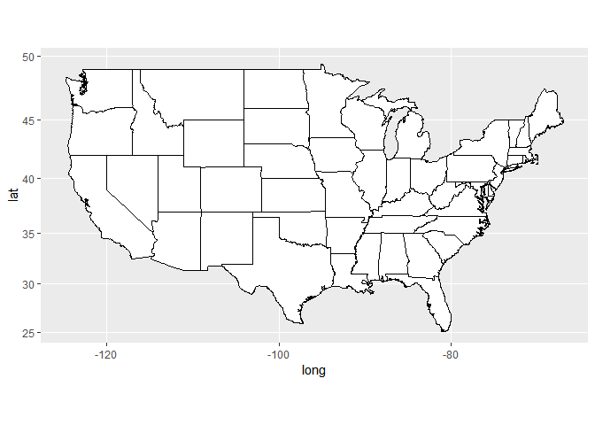
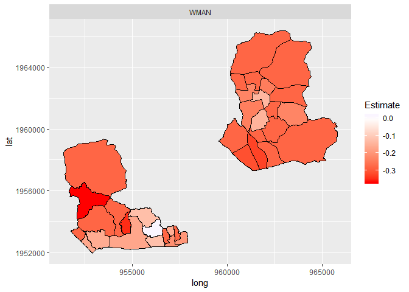
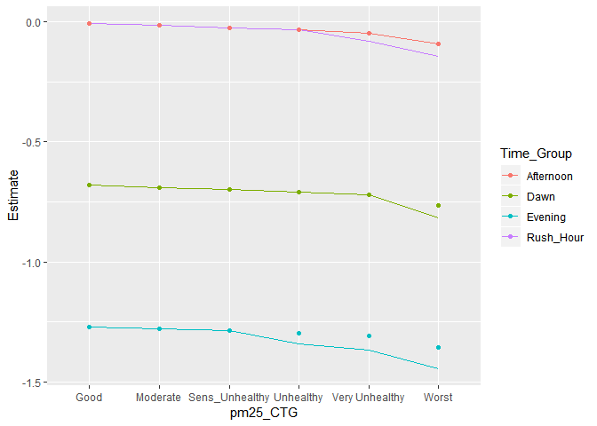
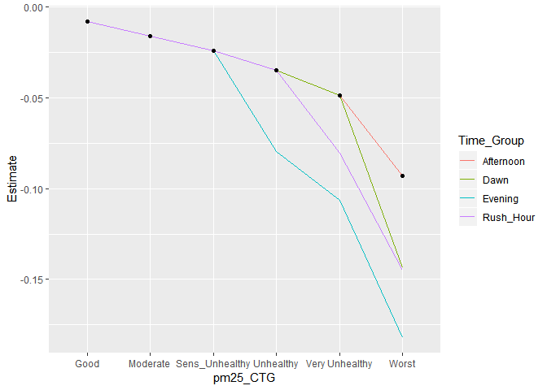
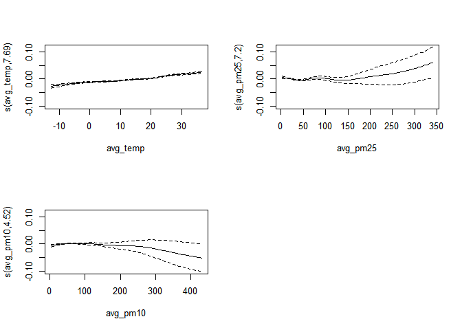
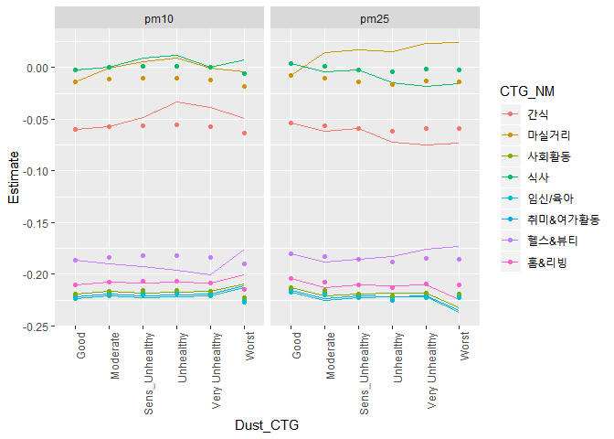
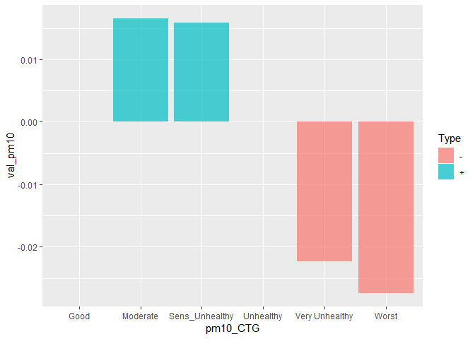
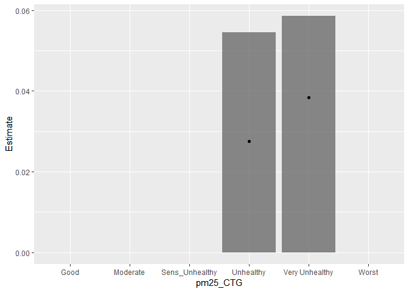
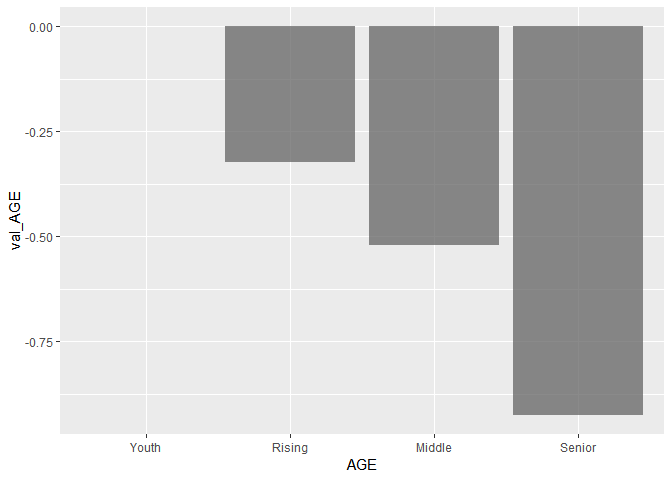
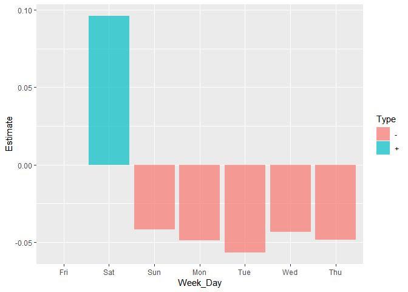

0. Data and Packages.
=====================

Load Data and packages.

``` r
library(tidyverse)
library(sp)
library(data.table)
library(rebus)
library(readxl)
library(ggplot2)
library(nlme)
library(cvTools)
library(splines)
library(gam)
library(ggmap)
source("bigcon_function.R")
HDong_CD <- readRDS("HDong_CD.rds") %>%
  mutate(HDONG_CD = as.character(HDONG_CD))
HDONG_map <- readRDS("HDONG_map.rds")
Dust_Warning <- readRDS("Dust_Warning.rds") %>%
  dplyr::select(Date, pm10_Wrn = PM_10, pm25_Wrn = PM_25)
Wth_Day_HDONG <- readRDS("Wth_Day_HDONG.rds") 

Card <- readRDS("Card.rds")
Dist <- readRDS("Dist.rds")
SK_Age <- readRDS("SK_Age.rds")
SK_Time <- readRDS("SK_Time.rds")
MCT_CAT_CD <- readRDS("MCT_CAT_CD.rds")
Dist_Category <- readRDS("Dist_Category.rds") %>%
  mutate(CTG_CD = as.character(CTG_CD))

Holiday <- read_excel("Holiday_List.xlsx") %>%
  mutate(Date = as.character(Date))

Dust_level  <- c("Good", "Moderate", "Sens_Unhealthy", "Unhealthy", "Very Unhealthy", "Worst")
Wrn_level <- c("No_Wrn", "Warning", "Dust_Watch")
Age_level <- c("Youth", "Rising", "Middle", "Senior")
Week_Day_lev <- c("Fri", "Sat", "Sun", "Mon", "Tue", "Wed", "Thu")
```

Issues
======

``` r
states <- map_data("state")
```

    ## Warning: package 'maps' was built under R version 3.6.1

    ## 
    ## Attaching package: 'maps'

    ## The following object is masked from 'package:purrr':
    ## 
    ##     map

``` r
usamap <- ggplot(states, aes(long, lat, group = group)) +
  geom_polygon(fill = "white", colour = "black")

usamap + coord_map(projection = "mercator")
```



We can use coord\_map to project map into mercator map. However, we
can’t use it in inference below. To use mercator projection, we need to
know the longtitude and latitude.

but, the shape file of Nowon and Jongno is privided just Cartesian x / y
coordinate.

``` r
HDONG_map %>% 
  select(long, lat) %>%
  summary()
```

    ##       long             lat         
    ##  Min.   :951368   Min.   :1951963  
    ##  1st Qu.:953344   1st Qu.:1953147  
    ##  Median :955662   Median :1953916  
    ##  Mean   :956490   Mean   :1955542  
    ##  3rd Qu.:959999   3rd Qu.:1957626  
    ##  Max.   :965812   Max.   :1966369

The latitude of South korea is 33 to 43, and longtitude is 124 to 132.
But in this HDONG_map shape file, longtitude is 951368 up to 965812, and the
latitude is 1951963 up to 1966369.

I think it is the reason why coor\_map does not work in my ggmap.

1) SK\_Age
----------

``` r
SK_Age_HDONG_Modified <- SK_Age %>%
  lapply(FUN = function(x) x %>% 
           gather(key = "Type", value = "Avg_pop", -STD_YM, -STD_YMD, -HDONG_CD, -HDONG_NM) %>%
           separate(Type, into = c("Sex", "Age"), sep = "_FLOW_POP_CNT_")) %>%
           bind_rows(.id = "MONTH") %>%
  mutate(HDONG_CD = str_remove_all(HDONG_CD, pattern = DGT %R% DGT %R% END), 
         Age = str_extract(Age, pattern = START %R% DGT %R% DGT),
         AGE_CTG = case_when(Age < 20 ~ "Youth", 
                         Age %in% 20:39 ~ "Rising", 
                         Age %in% 40:59 ~ "Middle", 
                         Age >= 60 ~ "Senior"), 
         AGE_CTG = factor(AGE_CTG, levels = c("Youth", "Rising", "Middle", "Senior")),
         Avg_pop = as.numeric(Avg_pop),
         Non_zero = ifelse(Avg_pop == 0, 0, 1), 
         Age = as.numeric(Age), 
         Sex = factor(Sex)) %>%
  left_join(Wth_Day_HDONG, by = c("STD_YMD" = "Day", "HDONG_CD"))
```

2) SK\_Time
-----------

``` r
SK_Time_HDONG_Modified <- SK_Time %>% 
  lapply(FUN = function(x) x %>%
           gather(key = "Time", value = "Avg_pop", -STD_YM, -STD_YMD, -HDONG_CD, -HDONG_NM) %>%
           mutate(Time = parse_number(Time), Avg_pop = as.numeric(Avg_pop))) %>%
  bind_rows() %>%
  mutate(HDONG_CD = str_remove_all(HDONG_CD, pattern = DGT %R% DGT %R% END)) %>%
  left_join(Wth_Day_HDONG, by = c("STD_YMD" = "Day", "HDONG_CD")) %>%
  mutate(Non_zero = ifelse(Avg_pop == 0, 0, 1)) %>%
  mutate(Time_Group = case_when(Time %in% 0:7 ~ "Dawn", 
                                Time %in% c(8:10, 17:19) ~ "Rush_Hour", 
                                Time %in% 11:16 ~ "Afternoon", 
                                Time %in% 20:23 ~ "Evening"), 
         Time_Group = factor(Time_Group), 
         Holiday = factor(Holiday))
```

3) Dist
-------

``` r
Dist_Modified <- Dist %>%
  ungroup %>%
  dplyr::select(OPER_DT, ADMD_CD, AMT_IND) %>%
  unique %>%
   mutate(OPER_DT = strptime(OPER_DT, format = "%Y%m%d") %>% as.character()) %>%
  left_join(Wth_Day_HDONG, by = c("OPER_DT" = "Day", "ADMD_CD" = "HDONG_CD")) %>%
  separate(OPER_DT, into = c("Year", "Month", "Day")) %>%
  mutate(Month = month.abb[as.numeric(Month)], 
         Month = factor(Month, levels = c("Apr", "May", "Jun", "Jul", "Aug", "Sep", "Oct", "Nov", 
                                          "Dec", "Jan", "Feb", "Mar"))) %>%
  left_join(HDong_CD, by = c("ADMD_CD" = "HDONG_CD")) %>%
  mutate(ADMD_CD = factor(ADMD_CD))
```

AMT\_IND 높은 순서대로 가회동, 부암동, 중계4동, 사직동, 중계본동,
평창동, 무악동, 삼청동, 이화동, 상계8동 등등…

``` r
Real_Dist <- Dist %>%
  ungroup() %>%
  mutate(Real_Value = value * AMT_IND, 
         OPER_DT = strptime(OPER_DT, format = "%Y%m%d") %>% as.character()) %>%
  left_join(Wth_Day_HDONG, by = c("OPER_DT" = "Day", "ADMD_CD" = "HDONG_CD")) %>%
  separate(OPER_DT, into = c("Year", "Month", "Day")) %>%
  mutate(Month = month.abb[as.numeric(Month)], 
         Month = factor(Month, levels = c("Apr", "May", "Jun", "Jul", "Aug", "Sep", "Oct", "Nov", 
                                          "Dec", "Jan", "Feb", "Mar")), 
         ADMD_CD = factor(ADMD_CD), 
         Category = factor(Category))
```

4) SH Card
----------

``` r
Rising <- c(25, 30, 35)
Middle <- c(40, 45, 50, 55)
Senior <- c(60, 65)

Card <- Card %>%
  mutate(AGE = case_when(AGE_CD == 20 ~ "Youth", 
                         AGE_CD %in% Rising ~ "Rising", 
                         AGE_CD %in% Middle ~ "Middle", 
                         AGE_CD %in% Senior ~ "Senior"), 
         AGE = factor(AGE, levels = c("Youth", "Rising", "Middle", "Senior"))) 

Card_Modified <- Card %>%
  separate(HDONG_CD, into = c("GU_CD", "DONG_CD"), sep = 2) %>%
  mutate(GU_CD = paste0("11", GU_CD), 
         DONG_CD = str_remove(DONG_CD, pattern = START %R% DGT)) %>%
  unite(HDONG_CD, GU_CD, DONG_CD, sep = "") %>%
  mutate(STD_DD = strptime(STD_DD, format = "%Y%m%d") %>% as.character())

Card_Daily <- left_join(Card_Modified, Wth_Day_HDONG, by = c("HDONG_CD", "STD_DD" = "Day")) %>%
  mutate(MCT_CAT_CD = factor(MCT_CAT_CD), 
         HDONG_CD = factor(HDONG_CD))
```

1. Modelling
============

This is final model for the inferences.

1) SK\_Age
----------

Gamma-Hurdle Model for SK\_Age Data.

``` r
glm_SK_Age_Binom <- glm(Non_zero ~ ., data = SK_Age_HDONG_Modified %>% select(-MONTH, -STD_YM, -STD_YMD, -HDONG_NM, -Avg_pop, -Holiday), family = binomial(link = "logit"))

glm_SK_Age_Gamma_HDONG <- glm(Avg_pop ~ HDONG_CD + Sex + Age + AGE_CTG + avg_temp + avg_pm10 + avg_pm25 + pm10_CTG + pm25_CTG + Week_Day + Holiday + HDONG_CD:pm25_CTG + HDONG_CD:AGE_CTG + HDONG_CD:Holiday + HDONG_CD:Sex + pm25_CTG:AGE_CTG, 
                         data = SK_Age_HDONG_Modified %>% filter(Non_zero == 1) %>%
                          select(-MONTH, -STD_YM, -STD_YMD, -HDONG_NM, -Non_zero), 
                         family = Gamma(link = "log"))
```

2) SK\_Time
-----------

Gamma-Hurdle Model for SK\_Time Data

``` r
glm_SK_Time_Binom <- glm(Non_zero ~ ., data = SK_Time_HDONG_Modified %>% select(-STD_YM, -STD_YMD, -HDONG_NM, -Avg_pop), family = binomial)

glm_SK_Time_Gamma_HDONG <- glm(Avg_pop ~ HDONG_CD + Time + Week_Day + avg_temp + avg_pm10 + avg_pm25 +
                                       pm10_CTG + pm25_CTG + pm10_Wrn + Holiday + Time_Group + 
                           HDONG_CD:Week_Day + HDONG_CD:pm25_CTG + HDONG_CD:Holiday +
                           HDONG_CD:Time_Group + pm25_CTG:Time_Group,
                                     data = SK_Time_HDONG_Modified %>% filter(Non_zero == 1), 
                                     family = Gamma(link = "log"))
```

3) Dist
-------

``` r
glm_Dist_Best <- glm(AMT_IND ~ Month + avg_temp + avg_pm10 + ADMD_CD + 
    pm10_CTG + pm25_CTG + Week_Day + pm10_Wrn + pm25_Wrn + Holiday + 
    pm10_CTG:Holiday + pm25_CTG:Holiday + pm10_Wrn:Holiday + 
    Month:pm10_CTG + ADMD_CD:pm10_CTG, data = Dist_Modified %>% na.omit(), family = Gamma(link = "log"))
```

``` r
gam_Dist <- mgcv::gam(Real_Value ~ Month + ADMD_CD + Category + s(avg_temp) + s(avg_pm25) + s(avg_pm10) + pm10_CTG + pm25_CTG + pm10_Wrn + pm25_Wrn + ADMD_CD:Category + ADMD_CD:Month + Month:Category + Holiday + Holiday:Category + Holiday:pm25_CTG + Week_Day +  Category:pm10_CTG + Category:pm25_CTG + Holiday:Category:pm25_CTG, data = Real_Dist, select = TRUE)
```

4) SH Card
----------

``` r
glm_NB_Card <- MASS::glm.nb(USE_CNT ~ MCT_CAT_CD + SEX_CD + AGE + HDONG_CD + avg_temp + avg_pm25 + 
                              pm10_CTG + pm25_CTG + pm25_Wrn + Week_Day + Holiday, 
                            data = Card_Daily)
```

2. Inferences
=============

Inference for the Models

1) SK\_Age
----------

``` r
summary_SK_Age <- summary(glm_SK_Age_Gamma_HDONG)$coefficients %>% data.frame() %>%
  rownames_to_column(var = "Variable") %>%
  tbl_df %>%
  `names<-`(value = c("Variable", "Estimate", "Std_Er", "t_val", "p_val"))
```

``` r
SK_Age_pm25_coef <-  glm_SK_Age_Gamma_HDONG$coefficients["avg_pm25"]


tibble(HDONG_CD = rep(HDong_CD$HDONG_CD, each = 6), 
       pm25_CTG = rep(Dust_level, 36)) %>%
  left_join(SK_Age_Main_Eff_Dust, by = "pm25_CTG") %>%
  left_join(SK_Age_Main_Eff_HDONG, by = "HDONG_CD") %>%
  left_join(SK_Age_Dust_HDONG, by = c("HDONG_CD", "pm25_CTG")) %>%
  mutate_all(replace_na, replace = 0) %>%
  mutate(Correction = case_when(pm25_CTG == "Good" ~ 10, 
                                pm25_CTG == "Moderate" ~ 20, 
                                pm25_CTG == "Sens_Unhealthy" ~ 30, 
                                pm25_CTG == "Unhealthy" ~ 43, 
                                pm25_CTG == "Very Unhealthy" ~ 60, 
                                pm25_CTG == "Worst" ~ 115), 
         Estimate = val_Dust + val_HDONG + val_Dust_HDONG + SK_Age_pm25_coef * Correction) %>%
  filter(pm25_CTG == "Good") %>%
  select(HDONG_CD, pm25_CTG, Estimate) %>%
  left_join(HDONG_map, by = "HDONG_CD") %>%
  ggplot() +
  geom_polygon(aes(x = long, y = lat, group = group, fill = Estimate), color = "black") +
  scale_fill_gradient2(low = "red", high = "blue") +
  facet_wrap(~pm25_CTG) +
  ggtitle("Default(Good-Youth-Weekday-MAN)")
```

-1.png)

``` r
SK_Age_pm25_coef <- glm_SK_Age_Gamma_HDONG$coefficients["avg_pm25"]

tibble(HDONG_CD = rep(HDong_CD$HDONG_CD, each = 6), 
       pm25_CTG = rep(Dust_level, 36)) %>%
  left_join(SK_Age_Main_Eff_Dust, by = "pm25_CTG") %>%
  left_join(SK_Age_Main_Eff_HDONG, by = "HDONG_CD") %>%
  left_join(SK_Age_Dust_HDONG, by = c("HDONG_CD", "pm25_CTG")) %>%
  mutate_all(replace_na, replace = 0) %>%
  mutate(Correction = case_when(pm25_CTG == "Good" ~ 10, 
                                pm25_CTG == "Moderate" ~ 20, 
                                pm25_CTG == "Sens_Unhealthy" ~ 30, 
                                pm25_CTG == "Unhealthy" ~ 43, 
                                pm25_CTG == "Very Unhealthy" ~ 60, 
                                pm25_CTG == "Worst" ~ 115), 
         Estimate = val_Dust + val_Dust_HDONG + SK_Age_pm25_coef * Correction) %>%
  select(HDONG_CD, pm25_CTG, Estimate) %>%
  left_join(HDONG_map, by = "HDONG_CD") %>%
  ggplot() +
  geom_polygon(aes(x = long, y = lat, group = group, fill = Estimate), color = "black") +
  scale_fill_gradient2(low = "red", high = "blue") +
  facet_wrap(~pm25_CTG) 
```

-1.png)

-   Correction 값으로는 pm25\_CTG 별 avg\_pm25의 평균 값 사용

``` r
SK_Age_Age_coef <- glm_SK_Age_Gamma_HDONG$coefficients["Age"]

tibble(HDONG_CD = HDong_CD$HDONG_CD %>% rep(each = 4), 
       AGE_CTG = Age_level %>% rep(36)) %>%
  left_join(SK_Age_Main_Eff_HDONG, by = "HDONG_CD") %>%
  left_join(SK_Age_Main_Eff_AGE, by = "AGE_CTG") %>%
  left_join(SK_Age_HDONG_AGE, by = c("HDONG_CD", "AGE_CTG")) %>%
  mutate_all(replace_na, 0) %>%
  mutate(Correction = case_when(AGE_CTG == "Youth" ~ 10, 
                                AGE_CTG == "Rising" ~ 30, 
                                AGE_CTG == "Middle" ~ 50, 
                                AGE_CTG == "Senior" ~ 60), 
         Estimate = val_AGE_CTG + val_HDONG_AGE + SK_Age_Age_coef * Correction, 
         AGE_CTG = factor(AGE_CTG, levels = Age_level)) %>%
  select(HDONG_CD, AGE_CTG, Estimate) %>%
  left_join(HDONG_map, by = "HDONG_CD") %>% 
  ggplot() +
  geom_polygon(aes(x = long, y = lat, group = group, fill = Estimate), color = "black") +
  scale_fill_gradient2(low = "red", high = "blue") +
  facet_wrap(~AGE_CTG) 
```


``` r
tibble(HDONG_CD = HDong_CD$HDONG_CD %>% rep(each = 2), 
       Holiday = c(0, 1) %>% rep(36) %>% as.character) %>%
  left_join(SK_Age_Main_Eff_HDONG, by = "HDONG_CD") %>%
  left_join(SK_Age_Main_Eff_Hol, by = "Holiday") %>%
  left_join(SK_Age_HDONG_Hol, by = c("HDONG_CD", "Holiday")) %>%
  mutate_all(replace_na, 0) %>%
  mutate(Estimate = val_Hol + val_HDONG_Hol) %>%   left_join(HDONG_map, by = "HDONG_CD") %>% 
  filter(Holiday == "1") %>%
  ggplot() +
  geom_polygon(aes(x = long, y = lat, group = group, fill = Estimate), color = "black") +
  scale_fill_gradient2(low = "red", high = "blue") +
  facet_wrap(~Holiday) 
```


``` r
tibble(HDONG_CD = HDong_CD$HDONG_CD, 
       Sex = "WMAN") %>%
  left_join(SK_Age_Main_Eff_Sex, by = "Sex") %>%
  left_join(SK_Age_HDONG_Sex, by = c("HDONG_CD", "Sex")) %>%
  mutate_all(replace_na, 0) %>%
  mutate(Estimate = val_Sex + val_HDONG_Sex) %>%
  left_join(HDONG_map, by = "HDONG_CD") %>%
  ggplot() +
  geom_polygon(aes(x = long, y = lat, group = group, fill = Estimate), color = "black") +
  scale_fill_gradient2(low = "red", high = "blue") +
  facet_wrap(~Sex) 
```



``` r
tibble(AGE_CTG = Age_level %>% rep(each = 6), 
       pm25_CTG = Dust_level %>% rep(4)) %>%
  left_join(SK_Age_Main_Eff_AGE, by = "AGE_CTG") %>%
  left_join(SK_Age_Main_Eff_Dust, by = "pm25_CTG") %>%
  left_join(SK_Age_Age_pm25, by = c("AGE_CTG", "pm25_CTG")) %>%
  mutate_all(replace_na, 0) %>%
  mutate(Correction_Dust = case_when(pm25_CTG == "Good" ~ 10, 
                                pm25_CTG == "Moderate" ~ 20, 
                                pm25_CTG == "Sens_Unhealthy" ~ 30, 
                                pm25_CTG == "Unhealthy" ~ 43, 
                                pm25_CTG == "Very Unhealthy" ~ 60, 
                                pm25_CTG == "Worst" ~ 115), 
         Correction_Age = case_when(AGE_CTG == "Youth" ~ 10, 
                                AGE_CTG == "Rising" ~ 30, 
                                AGE_CTG == "Middle" ~ 50, 
                                AGE_CTG == "Senior" ~ 60),
         Estimate = val_AGE_CTG + val_Dust + val_AGE_pm25 + SK_Age_pm25_coef * Correction_Dust +
           SK_Age_Age_coef * Correction_Age, 
         Est_point = SK_Age_pm25_coef * Correction_Dust + SK_Age_Age_coef * Correction_Age +
           val_AGE_CTG) %>%
  ggplot() +
  geom_line(aes(x = pm25_CTG, y = Estimate, group = AGE_CTG, color = AGE_CTG)) +
  geom_point(aes(x = pm25_CTG, y = Est_point, color = AGE_CTG))
```



``` r
tibble(AGE_CTG = Age_level %>% rep(each = 6), 
       pm25_CTG = Dust_level %>% rep(4)) %>%
  left_join(SK_Age_Main_Eff_AGE, by = "AGE_CTG") %>%
  left_join(SK_Age_Main_Eff_Dust, by = "pm25_CTG") %>%
  left_join(SK_Age_Age_pm25, by = c("AGE_CTG", "pm25_CTG")) %>%
  mutate_all(replace_na, 0) %>%
  mutate(Correction_Dust = case_when(pm25_CTG == "Good" ~ 10, 
                                pm25_CTG == "Moderate" ~ 20, 
                                pm25_CTG == "Sens_Unhealthy" ~ 30, 
                                pm25_CTG == "Unhealthy" ~ 43, 
                                pm25_CTG == "Very Unhealthy" ~ 60, 
                                pm25_CTG == "Worst" ~ 115), 
         Correction_Age = case_when(AGE_CTG == "Youth" ~ 10, 
                                AGE_CTG == "Rising" ~ 30, 
                                AGE_CTG == "Middle" ~ 50, 
                                AGE_CTG == "Senior" ~ 60),
         Estimate = val_Dust + val_AGE_pm25 + SK_Age_pm25_coef * Correction_Dust, 
         Est_point = SK_Age_pm25_coef * Correction_Dust) %>%
  ggplot() +
  geom_line(aes(x = pm25_CTG, y = Estimate, group = AGE_CTG, color = AGE_CTG)) +
  geom_point(aes(x = pm25_CTG, y = Est_point))
```



Youth와 Middle 동일.

2) SK\_Time
-----------

``` r
summary_SK_Time <- summary(glm_SK_Time_Gamma_HDONG)$coefficients %>% data.frame() %>%
  rownames_to_column(var = "Variable") %>%
  tbl_df %>%
  `names<-`(value = c("Variable", "Estimate", "Std_Er", "t_val", "p_val"))
```

``` r
tibble(HDONG_CD = HDong_CD$HDONG_CD) %>%
  left_join(SK_Time_Main_Eff_HDONG, by = "HDONG_CD") %>%
  mutate_all(replace_na, 0) %>%
  left_join(HDONG_map, by = "HDONG_CD") %>%
  ggplot() +
  geom_polygon(aes(x = long, y = lat, group = group, fill = val_HDONG_CD), color = "black") +
  scale_fill_gradient2(low = "red", high = "blue") +
  ggtitle("SK_Time-Good-Fri-Weekday-Afternoon")
```


``` r
SK_Time_pm25_coef <- glm_SK_Time_Gamma_HDONG$coefficients["avg_pm25"]

tibble(HDONG_CD = HDong_CD$HDONG_CD %>% rep(each = 6), 
       pm25_CTG = Dust_level %>% rep(36)) %>%
  left_join(SK_Time_Main_Eff_Dust, by = "pm25_CTG") %>%
  left_join(SK_Time_HDONG_pm25, by = c("HDONG_CD", "pm25_CTG")) %>%
  mutate_all(replace_na, 0) %>%
  mutate(Correction = case_when(pm25_CTG == "Good" ~ 10, 
                                pm25_CTG == "Moderate" ~ 20, 
                                pm25_CTG == "Sens_Unhealthy" ~ 30, 
                                pm25_CTG == "Unhealthy" ~ 43, 
                                pm25_CTG == "Very Unhealthy" ~ 60, 
                                pm25_CTG == "Worst" ~ 115), 
         Estimate = val_Dust + val_HDONG_pm25 + SK_Time_pm25_coef * Correction) %>%
  left_join(HDONG_map, by = "HDONG_CD") %>%
  ggplot() +
  geom_polygon(aes(x = long, y = lat, group = group, fill = Estimate), color = "black") +
  scale_fill_gradient2(low = "red", high = "blue") +
  facet_wrap(~pm25_CTG)
```


``` r
Target_Week <- c("Fri", "Mon", "Sat", "Sun")

tibble(HDONG_CD = HDong_CD$HDONG_CD %>% rep(each = 7), 
       Week_Day = Week_Day_lev %>% rep(36)) %>%
  left_join(SK_Time_Main_Eff_Week_Day, by = "Week_Day") %>%
  left_join(SK_Time_HDONG_Week, by = c("HDONG_CD", "Week_Day")) %>%
  mutate_all(replace_na, 0) %>%
  mutate(Estimate = val_Week + val_HDONG_Week) %>%
  filter(Week_Day %in% Target_Week) %>%
  left_join(HDONG_map, by = "HDONG_CD") %>%
  ggplot() +
  geom_polygon(aes(x = long, y = lat, group = group, fill = Estimate), color = "black") +
  scale_fill_gradient2(low = "red", high = "blue") +
  facet_wrap(~Week_Day)
```


``` r
tibble(HDONG_CD = HDong_CD$HDONG_CD, 
       Holiday = "1") %>%
  left_join(SK_Time_Main_Eff_Hol, by = "Holiday") %>%
  left_join(SK_Time_HDONG_Hol, by = c("HDONG_CD", "Holiday")) %>%
  mutate_all(replace_na, 0) %>%
  mutate(Estimate = val_Hol + val_HDONG_Hol) %>%
  left_join(HDONG_map, by = "HDONG_CD") %>%
  ggplot() +
  geom_polygon(aes(x = long, y = lat, group = group, fill = Estimate), color = "black") +
  scale_fill_gradient2(low = "red", high = "blue") +
  facet_wrap(~Holiday)
```


``` r
tibble(HDONG_CD = HDong_CD$HDONG_CD %>% rep(each = 4), 
       Time_Group = c("Dawn", "Rush_Hour", "Afternoon", "Evening") %>% rep(36)) %>%
  left_join(SK_Time_Main_Eff_Time_Gr, by = "Time_Group") %>%
  left_join(SK_Time_HDONG_Time_Gr, by = c("HDONG_CD", "Time_Group")) %>%
  mutate_all(replace_na, 0) %>%
  mutate(Estimate = val_Time_GR + val_HDONG_Time_Gr, 
         Time_Group = Time_Group %>% factor(levels = c("Dawn", "Rush_Hour", "Afternoon", "Evening"))) %>%
  left_join(HDONG_map, by = "HDONG_CD") %>%
  ggplot() +
  geom_polygon(aes(x = long, y = lat, group = group, fill = Estimate), color = "black") +
  scale_fill_gradient2(low = "red", high = "blue") +
  facet_wrap(~Time_Group)
```


``` r
tibble(pm25_CTG = Dust_level %>% rep(each = 4), 
       Time_Group = c("Dawn", "Rush_Hour", "Afternoon", "Evening") %>% rep(6)) %>%
  left_join(SK_Time_Main_Eff_Dust, by = "pm25_CTG") %>%
  left_join(SK_Time_Main_Eff_Time_Gr, by = "Time_Group") %>%
  left_join(SK_Time_pm25_Time_Gr, by = c("pm25_CTG", "Time_Group")) %>%
  mutate_all(replace_na, 0) %>%
  mutate(Correction = case_when(pm25_CTG == "Good" ~ 10, 
                                pm25_CTG == "Moderate" ~ 20, 
                                pm25_CTG == "Sens_Unhealthy" ~ 30, 
                                pm25_CTG == "Unhealthy" ~ 43, 
                                pm25_CTG == "Very Unhealthy" ~ 60, 
                                pm25_CTG == "Worst" ~ 115), 
         Estimate = val_Dust + val_Time_GR + val_pm25_Time_Gr + SK_Time_pm25_coef * Correction, 
         Est_point = val_Time_GR + SK_Time_pm25_coef * Correction) %>%
  ggplot() +
  geom_line(aes(x = pm25_CTG, y = Estimate, group = Time_Group, color = Time_Group)) +
  geom_point(aes(x = pm25_CTG, y = Est_point, color = Time_Group))
```


``` r
tibble(pm25_CTG = Dust_level %>% rep(each = 4), 
       Time_Group = c("Dawn", "Rush_Hour", "Afternoon", "Evening") %>% rep(6)) %>%
  left_join(SK_Time_Main_Eff_Dust, by = "pm25_CTG") %>%
  left_join(SK_Time_Main_Eff_Time_Gr, by = "Time_Group") %>%
  left_join(SK_Time_pm25_Time_Gr, by = c("pm25_CTG", "Time_Group")) %>%
  mutate_all(replace_na, 0) %>%
  mutate(Correction = case_when(pm25_CTG == "Good" ~ 10, 
                                pm25_CTG == "Moderate" ~ 20, 
                                pm25_CTG == "Sens_Unhealthy" ~ 30, 
                                pm25_CTG == "Unhealthy" ~ 43, 
                                pm25_CTG == "Very Unhealthy" ~ 60, 
                                pm25_CTG == "Worst" ~ 115), 
         Estimate = val_Dust + val_pm25_Time_Gr + SK_Time_pm25_coef * Correction, 
         Est_point = SK_Time_pm25_coef * Correction) %>%
  ggplot() +
  geom_line(aes(x = pm25_CTG, y = Estimate, group = Time_Group, color = Time_Group)) +
  geom_point(aes(x = pm25_CTG, y = Est_point))
```



``` r
Age_seq <- seq(0, 100, by = 5)
JONGNO_GU <- read_excel("Report_Population.xls", range = "C8:C58", col_names = "HDONG_NM") %>% 
  pull() %>% unique
NOWON_GU <- read_excel("Report_Population.xls", range = "C509:C565", col_names = "HDONG_NM") %>% 
  pull() %>% unique

People_Jongno <- read_excel("Report_Population.xls", range = "D1:Z58", col_types = "text") %>%
  `names<-`(value = c("Type", "Total", paste0("Age_", Age_seq))) %>%
  filter(Type == "계")
People_Jongno <- People_Jongno[-(1:2), ] %>%
  mutate(Type = JONGNO_GU)
People_Nowon <- read_excel("Report_Population.xls", range = "D509:Z565", col_names = FALSE, 
                           col_types = "text") %>%
  `names<-`(value = c("Type", "Total", paste0("Age_", Age_seq))) %>%
  filter(Type == "계") %>%
  mutate(Type = NOWON_GU)

People <- bind_rows(People_Jongno, People_Nowon) %>%
  mutate(Type = str_replace_all(Type, pattern = "·", replacement = ".")) %>%
  left_join(y = HDong_CD, by = c("Type" = "HDONG_NM"))
```

``` r
People <- readRDS("People.rds")
Target_HDONG <- c("11350619", "11350600", "11110640", "11110680", "11110550", "11350560")
People %>%
  gather(key = "AGE", value = "value", -Type, -Total, -HDONG_CD, -GU_CD, -GU_NM) %>%
  select(HDONG_CD, AGE, value) %>%
  mutate(AGE = parse_number(AGE), value = as.numeric(value)) %>%
  filter(HDONG_CD %in% Target_HDONG) %>%
  mutate(Type = ifelse(HDONG_CD %in% c(11110550, 11350560), "-", "+"))%>%
  left_join(HDong_CD, by = "HDONG_CD") %>%
  ggplot() +
  geom_col(aes(x = AGE, y = value, fill = Type), color = "white") +
  facet_wrap(~HDONG_NM, scales = "free") +
  ggtitle("Population for Suspicious HDONG")
```


11350619 (중계본동) (45, 50 대가 제일 많다.)

11350600 (공릉2동) (20, 45, 50 대가 제일 많다.)

11110640(이화동)

11110680(창신2동)

------------------------------------------------------------------------

11110550 (부암동)

11350560(월계1동)

3) Dist
-------

### (1) glm\_Dist

Use Gamma-glm

``` r
summary_glm_Dist <- summary(glm_Dist_Best)$coefficients %>% data.frame() %>%
  rownames_to_column(var = "Variable") %>%
  tbl_df %>%
  `names<-`(value = c("Variable", "Estimate", "Std_Er", "t_val", "p_val"))
```

-   pm10\_CTG 의 Main\_Eff 는 없음!

``` r
tibble(pm25_CTG = rep(Dust_level, each = 2), 
       Holiday = rep(c(0, 1), 6) %>% as.character) %>%
  left_join(glm_Dist_Main_Eff_pm25, by = "pm25_CTG") %>%
  left_join(glm_Dist_Main_Eff_Hol, by = "Holiday") %>%
  left_join(glm_Dist_pm25_Hol, by = c("pm25_CTG", "Holiday")) %>%
  mutate_all(replace_na, 0) %>%
  mutate(Estimate = val_pm25 + val_Hol + val_pm25_Hol) %>%
  ggplot() +
  geom_line(aes(x = pm25_CTG, y = Estimate, group = Holiday, color = Holiday))
```


-   avg\_pm25 없음…

``` r
glm_Dist_pm10_coef <- summary_glm_Dist %>% filter(Variable == "avg_pm10") %>% .$Estimate

tibble(pm10_CTG = rep(Dust_level, each = 2), 
       Holiday = rep(c(0, 1), 6) %>% as.character) %>%
  left_join(glm_Dist_Main_Eff_Hol, by = "Holiday") %>%
  left_join(glm_Dist_pm10_Hol, by = c("pm10_CTG", "Holiday")) %>%
  mutate_all(replace_na, 0) %>%
  mutate(Correction = case_when(pm10_CTG == "Good" ~ 22, 
                                pm10_CTG == "Moderate" ~ 40, 
                                pm10_CTG == "Sens_Unhealthy" ~ 61, 
                                pm10_CTG == "Unhealthy" ~ 86, 
                                pm10_CTG == "Very Unhealthy" ~ 117, 
                                pm10_CTG == "Worst" ~ 207), 
         Estimate = val_Hol + val_pm10_Hol + glm_Dist_pm10_coef * Correction, 
         Est_point = val_Hol + glm_Dist_pm10_coef * Correction) %>%
  ggplot() +
  geom_line(aes(x = pm10_CTG, y = Estimate, group = Holiday, color = Holiday)) +
  geom_point(aes(x = pm10_CTG, y = Est_point, color = Holiday))
```

-1.png)

``` r
tibble(pm10_Wrn = rep(Wrn_level, each = 2), 
       Holiday = rep(c(0, 1), 3) %>% as.character) %>%
  left_join(glm_Dist_Main_Eff_Hol, by = "Holiday") %>%
  left_join(glm_Dist_pm10_Wrn_Hol, by = c("pm10_Wrn", "Holiday")) %>%
  mutate_all(replace_na, 0) %>%
  mutate(pm10_Wrn = factor(pm10_Wrn, levels = Wrn_level), 
         Correction = case_when(pm10_Wrn == "No_Wrn" ~ 0, 
                                pm10_Wrn == "Warning" ~ 150, 
                                pm10_Wrn == "Dust_Watch" ~ 300), 
         Estimate = val_Hol + val_pm10_Wrn_Hol + glm_Dist_pm10_coef * Correction, 
         Est_point = val_Hol + glm_Dist_pm10_coef * Correction) %>%
  ggplot() +
  geom_line(aes(x = pm10_Wrn, y = Estimate, group = Holiday, color = Holiday)) +
  geom_point(aes(x = pm10_Wrn, y = Est_point, color = Holiday))
```


``` r
tibble(Month = rep(c("Apr", "May", "Jun", "Jul", "Aug", "Sep", "Oct", "Nov", "Dec", "Jan", "Feb", "Mar"),
                   each = 6), 
       pm10_CTG = rep(Dust_level, 12)) %>%
  left_join(glm_Dist_Main_Eff_Mon, by = "Month") %>%
  left_join(glm_Dist_Mon_pm10_CTG, by = c("Month", "pm10_CTG")) %>%
  mutate_all(replace_na, 0) %>%
  mutate(Correction = case_when(pm10_CTG == "Good" ~ 22, 
                                pm10_CTG == "Moderate" ~ 40, 
                                pm10_CTG == "Sens_Unhealthy" ~ 61, 
                                pm10_CTG == "Unhealthy" ~ 86, 
                                pm10_CTG == "Very Unhealthy" ~ 117, 
                                pm10_CTG == "Worst" ~ 207), 
         Estimate = val_Mon + val_Mon_pm10 + glm_Dist_pm10_coef * Correction, 
         Est_point = val_Mon + glm_Dist_pm10_coef * Correction) %>%
  ggplot() +
  geom_line(aes(x = pm10_CTG, y = Estimate, group = Month, color = Month)) +
  geom_point(aes(x = pm10_CTG, y = Est_point, color = Month))
```


``` r
tibble(Month = rep(c("Apr", "May", "Jun", "Jul", "Aug", "Sep", "Oct", "Nov", "Dec", "Jan", "Feb", "Mar"),
                   each = 6), 
       pm10_CTG = rep(Dust_level, 12)) %>%
  left_join(glm_Dist_Main_Eff_Mon, by = "Month") %>%
  left_join(glm_Dist_Mon_pm10_CTG, by = c("Month", "pm10_CTG")) %>%
  mutate_all(replace_na, 0) %>%
  mutate(Correction = case_when(pm10_CTG == "Good" ~ 22, 
                                pm10_CTG == "Moderate" ~ 40, 
                                pm10_CTG == "Sens_Unhealthy" ~ 61, 
                                pm10_CTG == "Unhealthy" ~ 86, 
                                pm10_CTG == "Very Unhealthy" ~ 117, 
                                pm10_CTG == "Worst" ~ 207), 
         Estimate = val_Mon_pm10 + glm_Dist_pm10_coef * Correction, 
         Est_point = glm_Dist_pm10_coef * Correction) %>%
  ggplot() +
  geom_line(aes(x = pm10_CTG, y = Estimate, group = Month, color = Month)) +
  geom_point(aes(x = pm10_CTG, y = Est_point))
```


``` r
tibble(HDONG_CD = rep(HDong_CD$HDONG_CD, each = 6), 
       pm10_CTG = rep(Dust_level, 36)) %>%
  left_join(glm_Dist_Main_Eff_HDONG, by = "HDONG_CD") %>%
  left_join(glm_Dist_HDONG_pm10_CTG, by = c("HDONG_CD", "pm10_CTG")) %>%
  mutate_all(replace_na, 0) %>%
  mutate(Correction = case_when(pm10_CTG == "Good" ~ 22, 
                                pm10_CTG == "Moderate" ~ 40, 
                                pm10_CTG == "Sens_Unhealthy" ~ 61, 
                                pm10_CTG == "Unhealthy" ~ 86, 
                                pm10_CTG == "Very Unhealthy" ~ 117, 
                                pm10_CTG == "Worst" ~ 207), 
         Estimate = val_HDONG + val_HDONG_pm10 + glm_Dist_pm10_coef * Correction) %>%
  left_join(HDONG_map, by = "HDONG_CD") %>%
  ggplot() +
  geom_polygon(aes(x = long, y = lat, group = group, fill = Estimate), color = "black") +
  scale_fill_gradient2(low = "red", high = "blue") +
  facet_wrap(~pm10_CTG)
```


``` r
tibble(HDONG_CD = rep(HDong_CD$HDONG_CD, each = 6), 
       pm10_CTG = rep(Dust_level, 36)) %>%
  left_join(glm_Dist_Main_Eff_HDONG, by = "HDONG_CD") %>%
  left_join(glm_Dist_HDONG_pm10_CTG, by = c("HDONG_CD", "pm10_CTG")) %>%
  mutate_all(replace_na, 0) %>%
  mutate(Correction = case_when(pm10_CTG == "Good" ~ 22, 
                                pm10_CTG == "Moderate" ~ 40, 
                                pm10_CTG == "Sens_Unhealthy" ~ 61, 
                                pm10_CTG == "Unhealthy" ~ 86, 
                                pm10_CTG == "Very Unhealthy" ~ 117, 
                                pm10_CTG == "Worst" ~ 207), 
         Estimate = val_HDONG_pm10 + glm_Dist_pm10_coef * Correction) %>%
  filter(pm10_CTG != "Good") %>%
  left_join(HDONG_map, by = "HDONG_CD") %>%
  ggplot() +
  geom_polygon(aes(x = long, y = lat, group = group, fill = Estimate), color = "black") +
  scale_fill_gradient2(low = "red", high = "blue") +
  facet_wrap(~pm10_CTG)
```

-1.png)

### (2) gam\_Dist

``` r
summary_gam_Dist <- summary(gam_Dist)$p.table %>%
  data.frame() %>%
  rownames_to_column(var = "Variable") %>%
  tbl_df %>%
  `names<-`(value = c("Variable", "Estimate", "Std_Er", "t_val", "p_val"))
```

``` r
Ref_Data <- tibble(avg_pm10 = c(22, 40, 61, 86, 117, 207), 
                   avg_pm25 = c(10, 20, 30, 43, 60, 115), 
                   Month = "Apr", ADMD_CD = "11110515", Category = "10", avg_temp = 30, 
                   pm10_CTG = "Good", pm25_CTG = "Good", pm10_Wrn = "No_Wrn", 
                   pm25_Wrn = "No_Wrn", Week_Day = "Fri", Holiday = "0")

preds_gam_Dist <- mgcv::predict.gam(gam_Dist, newdata = Ref_Data, type = "terms") %>% data.frame %>% 
  select(paste0("s.", c("avg_temp", "avg_pm25", "avg_pm10"), ".")) %>%
  mutate(DUst_level = Dust_level) %>%
  `colnames<-`(value = c("avg_temp", "avg_pm25", "avg_pm10", "Dust_level"))
```

``` r
tibble(HDONG_CD = rep(HDong_CD$HDONG_CD, each = 8), 
       Category = rep(Dist_Category$CTG_CD, 36) %>% as.character, 
       Category_NM = rep(Dist_Category$CTG_NM, 36)) %>%
  left_join(gam_Dist_Main_Eff_HDONG, by = "HDONG_CD") %>%
  left_join(gam_Dist_Main_Eff_CTG, by = "Category") %>%
  left_join(gam_Dist_HDONG_CTG, by = c("HDONG_CD", "Category")) %>%
  left_join(HDong_CD, by = "HDONG_CD") %>% 
  mutate_all(replace_na, 0) %>%
  mutate(Estimate = val_HDONG_CTG, 
         Estimate = ifelse(Category == "10", val_HDONG, Estimate)) %>%
  left_join(HDONG_map, by = "HDONG_CD") %>%
  filter(Category_NM %in% c("마실거리", "식사")) %>%
  ggplot() +
  geom_polygon(aes(x = long, y = lat, group = group, fill = Estimate), color = "black") +
  scale_fill_gradient2(low = "red", high = "blue") +
  facet_wrap(~Category_NM)
```


가구, 레저용품, 서적문구, 요식업소, 유통업, 의료기관, 자동차판매만
유의미

``` r
tibble(Category = rep(Dist_Category$CTG_CD, each = 2) %>% as.character, 
       Holiday = rep(c(0, 1), 8) %>% as.character) %>%
  left_join(gam_Dist_Main_Eff_CTG, by = "Category") %>%
  left_join(gam_Dist_Main_Eff_Hol, by = "Holiday") %>%
  left_join(gam_Dist_CTG_Hol, by = c("Category", "Holiday")) %>%
  left_join(Dist_Category, by = c("Category" = "CTG_CD")) %>% 
  mutate_all(replace_na, 0) %>%
  mutate(Estimate = val_CTG + val_Hol + val_CTG_Hol) %>%
  ggplot() +
  geom_bar(aes(x = CTG_NM, y = Estimate, fill = Holiday), stat = "identity", position = "dodge",
           alpha = 0.5) +
  theme(axis.text.x = element_text(angle = 90, hjust = 1))
```


``` r
tibble(Category = rep(Dist_Category$CTG_CD, each = 12), 
       pm25_CTG = rep(Dust_level, 8) %>% rep(each = 2), 
       Holiday = rep(c(0, 1), 48) %>% as.character) %>%
  left_join(gam_Dist_Main_Eff_CTG, by = "Category") %>%
  left_join(gam_Dist_Main_Eff_pm25, by = "pm25_CTG") %>%
  left_join(gam_Dist_Main_Eff_Hol, by = "Holiday") %>%
  left_join(gam_Dist_CTG_pm25, by = c("Category", "pm25_CTG")) %>%
  left_join(gam_Dist_CTG_Hol, by = c("Category", "Holiday")) %>%
  left_join(gam_Dist_pm25_CTG_Hol, by = c("pm25_CTG", "Holiday")) %>%
  left_join(gam_Dist_3_inter, by = c("Category", "pm25_CTG", "Holiday")) %>%
  mutate_all(replace_na, 0) %>%
  left_join(preds_gam_Dist, by = c("pm25_CTG" = "Dust_level")) %>%
  left_join(Dist_Category, by = c("Category" = "CTG_CD")) %>% 
  mutate(Estimate = val_CTG + val_pm25 + val_Hol + val_CTG_pm25 + val_CTG_Hol + val_pm25_CTG_Hol +
           val_3_inter + avg_pm25, 
         Est_point = val_CTG + avg_pm25 + val_Hol + val_CTG_Hol) %>%
  ggplot() +
  geom_line(aes(x = pm25_CTG, y = Estimate, group = CTG_NM, color = CTG_NM)) +
  geom_point(aes(x = pm25_CTG, y = Est_point, color = CTG_NM)) +
  theme(axis.text.x = element_text(angle = 90, hjust = 1)) +
  facet_wrap(~Holiday)
```


``` r
tibble(Category = rep(Dist_Category$CTG_CD, each = 12), 
       Dust_CTG = rep(Dust_level, 8) %>% rep(each = 2), 
       Type = rep(c("pm10", "pm25"), 48)) %>%
  left_join(gam_Dist_Main_Eff_pm10, by = c("Dust_CTG" = "pm10_CTG")) %>%
  left_join(gam_Dist_Main_Eff_pm25, by = c("Dust_CTG" = "pm25_CTG")) %>%
  left_join(gam_Dist_Main_Eff_CTG, by = "Category") %>%
  left_join(gam_Dist_CTG_pm10, by = c("Category", "Dust_CTG" = "pm10_CTG")) %>%
  left_join(gam_Dist_CTG_pm25, by = c("Category", "Dust_CTG" = "pm25_CTG")) %>%
  left_join(preds_gam_Dist, by = c("Dust_CTG" = "Dust_level")) %>%
  mutate_all(replace_na, 0) %>%
  mutate(Estimate = ifelse(Type == "pm10", val_pm10 + val_CTG + val_CTG_pm10 + avg_pm10, 0), 
         Estimate = ifelse(Type == "pm25", val_pm25 + val_CTG + val_CTG_pm25 + avg_pm25, Estimate), 
         Est_point = ifelse(Type == "pm10", val_CTG + avg_pm10, 0), 
         Est_point = ifelse(Type == "pm25", val_CTG + avg_pm25, Est_point)) %>%
  select(Category, Dust_CTG, Type, Estimate, Est_point) %>%
  left_join(Dist_Category, by = c("Category" = "CTG_CD")) %>% 
  ggplot() +
  geom_line(aes(x = Dust_CTG, y = Estimate, color = CTG_NM, group = CTG_NM)) +
  geom_point(aes(x = Dust_CTG, y = Est_point, color = CTG_NM)) +
  theme(axis.text.x = element_text(angle = 90, hjust = 1)) +
  facet_wrap(~Type)
```



``` r
Exclude_HDONG <- c("11110515", "11110540", "11110570", "11110680", "11110700", "11350570", "11350612", 
                   "11350621", "11350624", "11350630", "11350700", "11350710")

tibble(Month = rep(c("Apr", "May", "Jun", "Jul", "Aug", "Sep", "Oct", "Nov", "Dec", "Jan", "Feb", "Mar"), 
                   each = 36), 
       HDONG_CD = rep(HDong_CD$HDONG_CD, 12)) %>%
  left_join(gam_Dist_Main_Eff_Mon, by = "Month") %>%
  left_join(gam_Dist_Main_Eff_HDONG, by = "HDONG_CD") %>%
  left_join(gam_Dist_Mon_HDONG, by = c("Month", "HDONG_CD")) %>%
  mutate_all(replace_na, 0) %>%
  mutate(Estimate = val_HDONG + val_Mon_HDONG) %>%
  filter(!HDONG_CD %in% Exclude_HDONG) %>%
  left_join(HDong_CD, by = "HDONG_CD") %>% 
  ggplot() +
  geom_bar(aes(x = Month, y = Estimate, fill = GU_NM), stat = "identity", alpha = 0.7) +
  theme(axis.text.x=element_blank(), 
        axis.text.y = element_blank()) +
  facet_wrap(~HDONG_NM, scales = "free")
```


``` r
tibble(Month = rep(c("Apr", "May", "Jun", "Jul", "Aug", "Sep", "Oct", "Nov", "Dec", "Jan", "Feb", "Mar"), 
                   each = 36), 
       HDONG_CD = rep(HDong_CD$HDONG_CD, 12)) %>%
  left_join(gam_Dist_Main_Eff_Mon, by = "Month") %>%
  left_join(gam_Dist_Main_Eff_HDONG, by = "HDONG_CD") %>%
  left_join(gam_Dist_Mon_HDONG, by = c("Month", "HDONG_CD")) %>%
  mutate_all(replace_na, 0) %>%
  mutate(Estimate = val_HDONG + val_Mon_HDONG) %>%
  filter(!HDONG_CD %in% Exclude_HDONG) %>%
  left_join(HDong_CD, by = "HDONG_CD") %>% 
  ggplot() +
  geom_bar(aes(x = Month, y = Estimate, fill = GU_NM), stat = "identity", alpha = 0.7) +
  theme(axis.text.x=element_blank()) +
  facet_wrap(~HDONG_NM)
```


AMT\_IND 높은 순서대로 가회동, 부암동, 중계4동, 사직동, 중계본동,
평창동, 무악동, 삼청동, 이화동, 상계8동 등등…

4) SH Card
----------

``` r
summary_glm_NB_Card <- summary(glm_NB_Card)$coefficients %>% data.frame() %>%
  rownames_to_column(var = "Variable") %>%
  tbl_df %>%
  `names<-`(value = c("Variable", "Estimate", "Std_Er", "t_val", "p_val"))
```

``` r
summary_glm_NB_Card %>%
  filter(p_val <= 0.05, 
         Variable %>% str_detect("pm10_CTG")) %>%
  mutate(pm10_CTG = Variable %>% str_remove("pm10_CTG")) %>%
  select(pm10_CTG, val_pm10 = Estimate) %>%
  right_join(tibble(pm10_CTG = Dust_level), by = "pm10_CTG") %>%
  mutate(val_pm10 = val_pm10 %>% replace_na(0), 
         Type = ifelse(val_pm10 >= 0, "+", "-")) %>%
  ggplot() +
  geom_bar(aes(x = pm10_CTG, y = val_pm10, fill = Type), stat = "identity", alpha = 0.7)
```



glm\_NB\_Card는 avg\_pm10 없음.

``` r
glm_NB_Card_pm25_coef <- summary_glm_NB_Card %>% filter(Variable == "avg_pm25") %>% .$Estimate

summary_glm_NB_Card %>%
  filter(p_val <= 0.05, 
         Variable %>% str_detect("pm25_CTG")) %>%
  mutate(pm25_CTG = Variable %>% str_remove("pm25_CTG"), 
         Correction = case_when(pm25_CTG == "Good" ~ 10, 
                                pm25_CTG == "Moderate" ~ 20, 
                                pm25_CTG == "Sens_Unhealthy" ~ 30, 
                                pm25_CTG == "Unhealthy" ~ 43, 
                                pm25_CTG == "Very Unhealthy" ~ 60, 
                                pm25_CTG == "Worst" ~ 115), 
         Estimate = Estimate + glm_NB_Card_pm25_coef * Correction, 
         Est_point = glm_NB_Card_pm25_coef * Correction) %>%
  select(pm25_CTG, Estimate, Est_point) %>%
  right_join(tibble(pm25_CTG = Dust_level), by = "pm25_CTG") %>%
  mutate(Estimate = Estimate %>% replace_na(0)) %>%
  ggplot() +
  geom_bar(aes(x = pm25_CTG, y = Estimate), stat = "identity", alpha = 0.7) +
  geom_point(aes(x = pm25_CTG, y = Est_point))
```

    ## Warning: Removed 4 rows containing missing values (geom_point).



``` r
summary_glm_NB_Card %>%
  filter(p_val <= 0.05,
         Variable %>% str_detect("MCT_CAT_CD")) %>%
  mutate(Category = Variable %>% str_remove("MCT_CAT_CD")) %>%
  select(Category, val_CTG = Estimate) %>%
  right_join(MCT_CAT_CD, by = c("Category" = "MCT_CD")) %>%
  mutate(val_CTG = val_CTG %>% replace_na(0), 
         Type = ifelse(val_CTG >= 0, "+", "-")) %>%
  ggplot() +
  geom_bar(aes(x = MCT_NM, y = val_CTG, fill = Type), stat = "identity", alpha = 0.7) +
  theme(axis.text.x = element_text(angle = 90, hjust = 1))
```


``` r
summary_glm_NB_Card %>%
  filter(p_val <= 0.05, 
         Variable %>% str_detect("AGE")) %>%
  mutate(AGE = Variable %>% str_remove("AGE")) %>%
  select(AGE, val_AGE = Estimate) %>%
  right_join(tibble(AGE = c("Youth", "Rising", "Middle", "Senior")), by = "AGE") %>%
  mutate(val_AGE = val_AGE %>% replace_na(0), 
         Type = ifelse(val_AGE >= 0, "+", "-"), 
         AGE = AGE %>% factor(levels = c("Youth", "Rising", "Middle", "Senior"))) %>%
  ggplot() +
  geom_bar(aes(x = AGE, y = val_AGE), stat = "identity", alpha = 0.7)
```



``` r
summary_glm_NB_Card %>%
  filter(p_val <= 0.05, 
         Variable %>% str_detect("HDONG_CD")) %>%
  mutate(HDONG_CD = Variable %>% str_remove("HDONG_CD")) %>%
  select(HDONG_CD, val_HDONG = Estimate) %>%
  right_join(HDONG_map, by = "HDONG_CD") %>%
  mutate(val_HDONG = val_HDONG %>% replace_na(0)) %>%
  ggplot() +
  geom_polygon(aes(x = long, y = lat, fill = val_HDONG, group = group), color = "black") +
  scale_fill_gradient2(low = "red", high = "blue")
```


``` r
glm_NB_Card_Hol_coef <- summary_glm_NB_Card %>% filter(Variable == "Holiday1") %>% .$Estimate
Holiday <- c("Sat", "Sun")

summary_glm_NB_Card %>%
  filter(p_val <= 0.05, 
         Variable %>% str_detect("Week_Day")) %>%
  mutate(Week_Day = Variable %>% str_remove("Week_Day")) %>%
  right_join(tibble(Week_Day = Week_Day_lev), by = "Week_Day") %>%
  select(Week_Day, Estimate) %>%
  mutate(Estimate = Estimate %>% replace_na(0), 
         Estimate = ifelse(Week_Day %in% Holiday, Estimate + glm_NB_Card_Hol_coef, Estimate), 
         Week_Day = Week_Day %>% factor(levels = Week_Day_lev), 
         Type = ifelse(Estimate >= 0, "+", "-")) %>%
  ggplot() +
  geom_bar(aes(x = Week_Day, y = Estimate, fill = Type), stat = "identity", alpha = 0.7)
```



Sat, Sun에는 Holiday Effect 추가.
